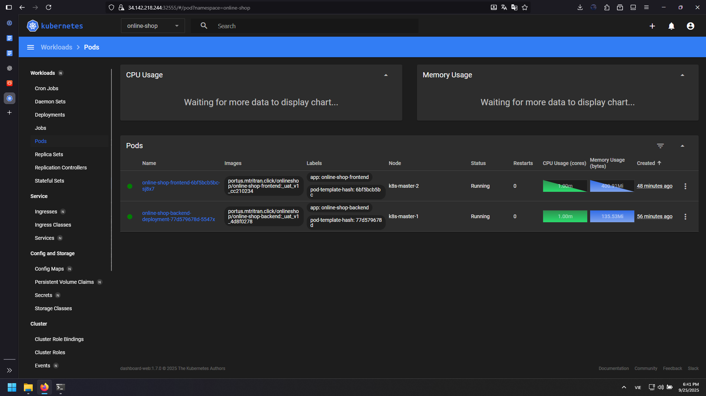
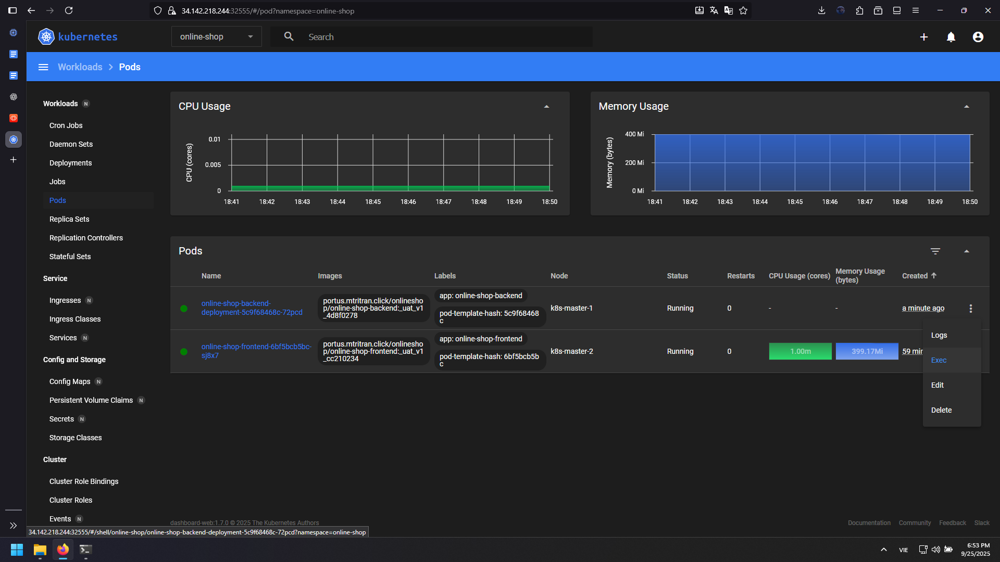
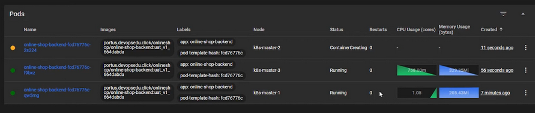
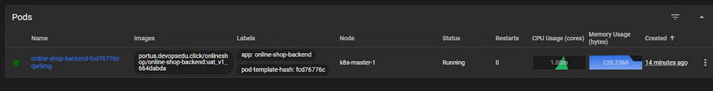

# Autoscaling (HPA) for `online-shop` on Kubernetes
*Following the same Markdown layout used in previous docs.*

---

## Goals
- Install **metrics-server** via Helm to collect resource metrics.
- Configure a **HorizontalPodAutoscaler (HPA)** based on CPU.
- Validate autoscaling using a simple CPU load generator.

---

## Prerequisites
- A healthy Kubernetes cluster with `cluster-admin` privileges.
- **Helm** installed and outbound internet access (to pull charts).
- **kubectl** configured to the correct cluster context and namespace.
- A container registry secret (e.g., `auth-registry`) if your image is private.

---

## Architecture (High-Level)
```
+--------------------+           +-------------------+
|  Users / Clients   |  --->     |  Service/Ingress  |
+--------------------+           +-------------------+
                                        |
                                        v
                               +-----------------------+
                               | online-shop-backend   |
                               |   Deployment (Pods)   |
                               +-----------------------+
                                        ^
                                        |
                                +--------------------+
                                | HorizontalPod      |
                                | Autoscaler (HPA)   |
                                +--------------------+
                                        ^
                                        |
                              +-----------------------+
                              |   metrics-server      |
                              | (CPU/Memory metrics)  |
                              +-----------------------+
```
*HPA reads metrics from `metrics-server` and scales the Deployment accordingly.*

---

## 1) Install `metrics-server` with Helm
```bash
helm repo add metrics-server https://kubernetes-sigs.github.io/metrics-server/
helm repo update

helm install metrics-server metrics-server/metrics-server -n kube-system
```

### 1.1) Add container args to `metrics-server` Deployment
Edit the Deployment to add recommended arguments (handy for homelabs/POCs):
```bash
kubectl edit deploy metrics-server -n kube-system
```
In `spec.template.spec.containers[0].args`, add:
```yaml
- --secure-port=4443
- --cert-dir=/tmp
- --kubelet-preferred-address-types=InternalIP,ExternalIP,Hostname
- --kubelet-insecure-tls=true
- --kubelet-use-node-status-port
- --metric-resolution=15s
```

### 1.2) Update container port to 4443
In `spec.template.spec.containers[0].ports`:
```yaml
ports:
  - containerPort: 4443
    name: https
    protocol: TCP
```

### 1.3) Roll out and verify
```bash
kubectl rollout restart deploy metrics-server -n kube-system
kubectl rollout status  deploy/metrics-server -n kube-system

kubectl get pods -n kube-system | grep metrics-server
kubectl top nodes
kubectl top pods -A
```



> Tip: If you use the Kubernetes Dashboard (often in `kube-system`), you should see live metrics once the server is healthy.

---

## 2) Deploy `online-shop-backend`

Import file Deployment (namespace `online-shop`). Make sure to adjust the image and secret names to your environment:
```yaml
apiVersion: apps/v1
kind: Deployment
metadata:
  name: online-shop-backend-deployment
  namespace: online-shop
  labels:
    app: online-shop-backend
spec:
  replicas: 1
  selector:
    matchLabels:
      app: online-shop-backend
  template:
    metadata:
      labels:
        app: online-shop-backend
    spec:
      containers:
        - name: online-shop-backend
          image: portus.mtritran.click/onlineshop/online-shop-backend:_uat_v1_4d8f0278
          ports:
            - containerPort: 5214
          resources:
            requests:
              memory: 256Mi
              cpu: 100m
      imagePullSecrets:
        - name: auth-registry
```
---

## 3) Create the HPA for `online-shop-backend`
Minimal v1 HPA based on CPU utilization:
```yaml
apiVersion: autoscaling/v1
kind: HorizontalPodAutoscaler
metadata:
  name: online-shop-backend-autoscaler
  namespace: online-shop
spec:
  scaleTargetRef:
    apiVersion: apps/v1
    kind: Deployment
    name: online-shop-backend-deployment
  minReplicas: 1
  maxReplicas: 3
  targetCPUUtilizationPercentage: 50
```
---

## 4) Generate load to trigger autoscaling
Open a shell in one of the Pods and generate CPU load > Select Exe:



```bash
apt update -y && apt install -y stress
stress --cpu 4
```

Now you can see the pod is increased to three:



```
**Expected:** replicas scale out (up to 3) while average CPU utilization stays above 50%.

Stop the load with `Ctrl + C`, then wait and watch replicas scale in after the cooldown period.



---

## Notes
- Default metrics scrape interval here is set with `--metric-resolution=15s`.
- `--kubelet-insecure-tls=true` is acceptable for labs/POCs. For production, configure proper TLS to the kubelet.
- Consider scaling on multiple metrics (CPU + custom metrics) for more robust behavior in production.
