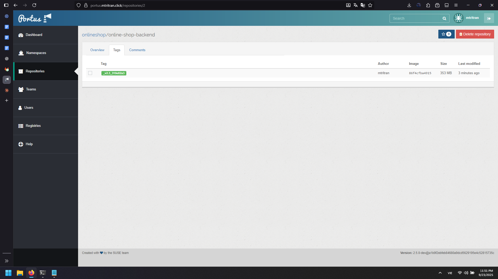

# Complete CI/CD Pipeline Guide

## Overview

This guide implements a comprehensive CI/CD pipeline with build image, security scanning image, push, and deployment stages using GitLab CI/CD, Docker, and Portus registry.

## 1. Build Stage Implementation

### Build Server Configuration

Configure sudo permissions for GitLab runner:

```bash
sudo visudo
```

Add the following line:
```
gitlab-runner ALL=(ALL) NOPASSWD:ALL
```

### Create Dockerfile

1. Create new branch `pipeline-be2` from `develop`


2. Create docker file for backend

**Backend Dockerfile:**
```dockerfile
FROM mcr.microsoft.com/dotnet/sdk:6.0
WORKDIR /app
COPY *.csproj ./
RUN dotnet restore
COPY . .
RUN dotnet build -c Release
ENV ASPNETCORE_URLS=http://0.0.0.0:5214 \
    ASPNETCORE_ENVIRONMENT=Development \
    DOTNET_EnableDiagnostics=0
EXPOSE 5214
CMD ["dotnet", "run", "-c", "Release"]
```

3. Do the same for the frontend

**Frontend Dockerfile:**
```dockerfile
FROM node:18-alpine
WORKDIR /app
COPY package*.json ./
RUN npm ci --prefer-offline --no-audit --progress=false
COPY . .
ENV HOST=0.0.0.0 \
    PORT=3000 \
    CI=true
EXPOSE 3000
CMD ["npm", "start"]
```

### Registry Configuration

Add environment variables in GitLab group settings:

| Variable | Value | Description |
|----------|--------|-------------|
| `CI_REGISTRY` | `portus.mtritran.click` | Registry hostname |
| `CI_REGISTRY_USER` | `<username>` | Registry username |
| `CI_REGISTRY_PASSWORD` | `<password>` | Registry password |
| `BE_PORT` | `5214:5214` | Backend port mapping |
| `FE_PORT` | `3000:3000` | Frontend port mapping |

### Build Pipeline Configuration

a. Create `.gitlab-ci.yml` with build stage at branch `pipeline-be2`:


```yaml
variables:
  USER_PROJECT: "onlineshop"
  IMAGE_VERSION: "${CI_REGISTRY}/${USER_PROJECT}/${CI_PROJECT_NAME}:${CI_COMMIT_BRANCH}_${CI_COMMIT_TAG}_${CI_COMMIT_SHORT_SHA}"

stages:
  - build

build:
  stage: build
  variables:
    GIT_STRATEGY: clone
  script:
    - docker build -t $IMAGE_VERSION .
  tags:
    - online-shop-runner-build-shell
  only:
    - tags
```

b. Create tag to trigger pipeline
c. After the job passed, check the image

```bash
root@build-server:~# docker images
REPOSITORY                                             TAG            IMAGE ID       CREATED         SIZE
portus.mtritran.click/onlineshop/online-shop-backend   _v2_8a053a42   a43b88d4d0c1   2 minutes ago   897MB
mcr.microsoft.com/dotnet/sdk                           6.0            9d227b99e32e   8 months ago    745MB
```

## 2. Image Security Scanning

### Manual Image Scan Test

Test Trivy image scanning manually:

```bash
# Check available images
docker images

# Run Trivy scan
docker run --rm \
  -v /var/run/docker.sock:/var/run/docker.sock \
  -v $PWD:/work \
  aquasec/trivy image \
  --format template \
  --template "@contrib/html.tpl" \
  --output /work/trivy-image-report.html \
  <image-name:tag>
```

### Image Scan Pipeline Stage

a. Add security scanning stage to pipeline:


```yaml
variables:
  USER_PROJECT: "onlineshop"
  IMAGE_VERSION: "${CI_REGISTRY}/${USER_PROJECT}/${CI_PROJECT_NAME}:${CI_COMMIT_BRANCH}_${CI_COMMIT_TAG}_${CI_COMMIT_SHORT_SHA}"
  TRIVY_IMAGE_REPORT: "${CI_PROJECT_NAME}_${CI_COMMIT_BRANCH}_${CI_COMMIT_TAG}_${CI_COMMIT_SHORT_SHA}_security_scan_image"

stages:
  - build
  - security_scan_image

build:
  stage: build
  variables:
    GIT_STRATEGY: clone
  script:
    - docker build -t $IMAGE_VERSION .
  tags:
    - online-shop-runner-build-shell
  only:
    - tags

trivy_scan_image:
  stage: security_scan_image
  variables:
    GIT_STRATEGY: none
  script:
    - docker run --rm -v /var/run/docker.sock:/var/run/docker.sock aquasec/trivy clean --all
    - docker run --rm -v /var/run/docker.sock:/var/run/docker.sock -v /tmp:/tmp aquasec/trivy image --format template --template "@contrib/html.tpl" --output /tmp/${TRIVY_IMAGE_REPORT}.html $IMAGE_VERSION
    - cp /tmp/${TRIVY_IMAGE_REPORT}.html .
  artifacts:
    paths:
      - "${TRIVY_IMAGE_REPORT}.html"
    expire_in: 1 day
  allow_failure: false
  tags:
    - online-shop-runner-build-shell
  only:
    - tags
```
b. Create tag to trigger pipeline
c. See the job passed


d. Download artifacts to see report: [artifacts/online-shop-backend__v2.2_aa5cc44c_security_scan_image.html](artifacts/online-shop-backend__v2.2_aa5cc44c_security_scan_image.html)


## 3. Push Stage Implementation

Add push stage to pipeline:

```yaml
variables:
  USER_PROJECT: "onlineshop"
  IMAGE_VERSION: "${CI_REGISTRY}/${USER_PROJECT}/${CI_PROJECT_NAME}:${CI_COMMIT_BRANCH}_${CI_COMMIT_TAG}_${CI_COMMIT_SHORT_SHA}"

stages:
  - build
  - security_scan_image
  - push

# ... previous stages ...

push:
  stage: push
  variables:
    GIT_STRATEGY: none
  before_script:
    - echo "$CI_REGISTRY_PASSWORD" | docker login -u "$CI_REGISTRY_USER" $CI_REGISTRY --password-stdin
  script:
    - docker push $IMAGE_VERSION
  after_script:
    - docker logout $CI_REGISTRY || true
  tags:
    - online-shop-runner-build-shell
  only:
    - tags
```



## 4. Deployment Stage

### Deploy Server Configuration

Configure deployment server permissions:

```bash
# Check user groups
groups <project-user>

# Add gitlab-runner to docker group
sudo usermod -aG docker gitlab-runner
sudo systemctl restart gitlab-runner

# Add sudo permissions
sudo visudo
```

Add line:
```
gitlab-runner ALL=(ALL) NOPASSWD:ALL
```

### Complete Pipeline with Deployment

**Backend Pipeline:**
```yaml
variables:
  USER_PROJECT: "onlineshop"
  IMAGE_VERSION: "${CI_REGISTRY}/${USER_PROJECT}/${CI_PROJECT_NAME}:${CI_COMMIT_BRANCH}_${CI_COMMIT_TAG}_${CI_COMMIT_SHORT_SHA}"

stages:
  - build
  - push
  - deploy

build:
  stage: build
  variables:
    GIT_STRATEGY: clone
  script:
    - docker build -t $IMAGE_VERSION .
  tags:
    - online-shop-runner-build-shell
  only:
    - tags

push:
  stage: push
  variables:
    GIT_STRATEGY: none
  before_script:
    - echo "$CI_REGISTRY_PASSWORD" | docker login -u "$CI_REGISTRY_USER" $CI_REGISTRY --password-stdin
  script:
    - docker push $IMAGE_VERSION
  after_script:
    - docker logout $CI_REGISTRY || true
  tags:
    - online-shop-runner-build-shell
  only:
    - tags

deploy:
  stage: deploy
  variables:
    GIT_STRATEGY: none
  before_script:
    - echo "$CI_REGISTRY_PASSWORD" | docker login -u "$CI_REGISTRY_USER" $CI_REGISTRY --password-stdin
  script:
    - docker rm -f $CI_PROJECT_NAME || true
    - docker pull $IMAGE_VERSION
    - sudo su ${USER_PROJECT} -c "docker run -d --name $CI_PROJECT_NAME -p $BE_PORT --restart=always $IMAGE_VERSION"
  after_script:
    - docker logout $CI_REGISTRY || true
  tags:
    - online-shop-runner-deploy-shell
  only:
    - tags
```

**Frontend Pipeline:**
```yaml
variables:
  USER_PROJECT: "onlineshop"
  IMAGE_VERSION: "${CI_REGISTRY}/${USER_PROJECT}/${CI_PROJECT_NAME}:${CI_COMMIT_BRANCH}_${CI_COMMIT_TAG}_${CI_COMMIT_SHORT_SHA}"

stages:
  - build
  - push
  - deploy

build:
  stage: build
  variables:
    GIT_STRATEGY: clone
  script:
    - docker build -t $IMAGE_VERSION .
  tags:
    - online-shop-runner-build-shell
  only:
    - tags

push:
  stage: push
  variables:
    GIT_STRATEGY: none
  before_script:
    - echo "$CI_REGISTRY_PASSWORD" | docker login -u "$CI_REGISTRY_USER" $CI_REGISTRY --password-stdin
  script:
    - docker push $IMAGE_VERSION
  after_script:
    - docker logout $CI_REGISTRY || true
  tags:
    - online-shop-runner-build-shell
  only:
    - tags

deploy:
  stage: deploy
  variables:
    GIT_STRATEGY: none
  before_script:
    - echo "$CI_REGISTRY_PASSWORD" | docker login -u "$CI_REGISTRY_USER" $CI_REGISTRY --password-stdin
  script:
    - docker rm -f $CI_PROJECT_NAME || true
    - docker pull $IMAGE_VERSION
    - sudo su ${USER_PROJECT} -c "docker run -d --name $CI_PROJECT_NAME -p $BE_PORT --restart=always $IMAGE_VERSION"
  after_script:
    - docker logout $CI_REGISTRY || true
  tags:
    - online-shop-runner-deploy-shell
  only:
    - tags
```
- File pipeline here: [pipeline/build-scan_image-push-deploy.yml](pipeline/build-scan_image-push-deploy.yml)
 
- Backend Swagger UI:


- Try querying to see if it gets the data from the db


- Do the same for frontend


## 5. Pipeline Execution Flow

### Branching Strategy

1. **Create Pipeline Branch:**
   - Branch name: `pipeline-be2` (backend) or `pipeline-fe2` (frontend)
   - Create from: `develop` branch

2. **Add Pipeline Configuration:**
   - Create/update `.gitlab-ci.yml` in branch
   - Add appropriate Dockerfile
   - Commit changes

3. **Trigger Pipeline:**
   - Create Git tag from pipeline branch
   - Tag naming: `v1`, `v2`, etc.
   - Pipeline auto-triggers on tag creation

### Pipeline Stages Execution

1. **Build Stage:**
   - Clones source code
   - Builds Docker image
   - Tags with unique identifier
   - Runs on build server

2. **Security Scan Stage (Optional):**
   - Scans built image for vulnerabilities
   - Generates HTML security report
   - Stores as pipeline artifact
   - Fails pipeline if critical issues found

3. **Push Stage:**
   - Authenticates with registry
   - Pushes image to Portus registry
   - Logs out from registry
   - Runs on build server

4. **Deploy Stage:**
   - Authenticates with registry
   - Pulls latest image version
   - Stops existing container
   - Starts new container with image
   - Runs on deployment server

## 6. Verification and Testing

### Backend Verification

1. **API Access:**
   - URL: `http://<deploy-server-ip>:5214/swagger`
   - Test API endpoints
   - Verify database connectivity

2. **Container Status:**
   ```bash
   docker ps
   docker logs <container-name>
   ```

### Frontend Verification

1. **Application Access:**
   - URL: `http://<deploy-server-ip>:3000`
   - Test user interface
   - Verify backend communication

2. **Container Health:**
   ```bash
   docker ps
   docker logs <container-name>
   ```

## 7. Pipeline Features

### Security Integration
- Automated vulnerability scanning
- Image security reports
- Pipeline failure on critical issues
- Artifact preservation for compliance

### Container Management
- Automated container replacement
- Zero-downtime deployments
- Health check integration
- Restart policies

### Registry Integration
- Private image storage
- Version tracking
- Authentication management
- Image lifecycle management

### Monitoring and Logging
- Pipeline execution logs
- Container runtime logs
- Deployment status tracking
- Error notification system

This comprehensive CI/CD pipeline provides automated build, security scanning, registry management, and deployment capabilities with proper error handling and security controls.