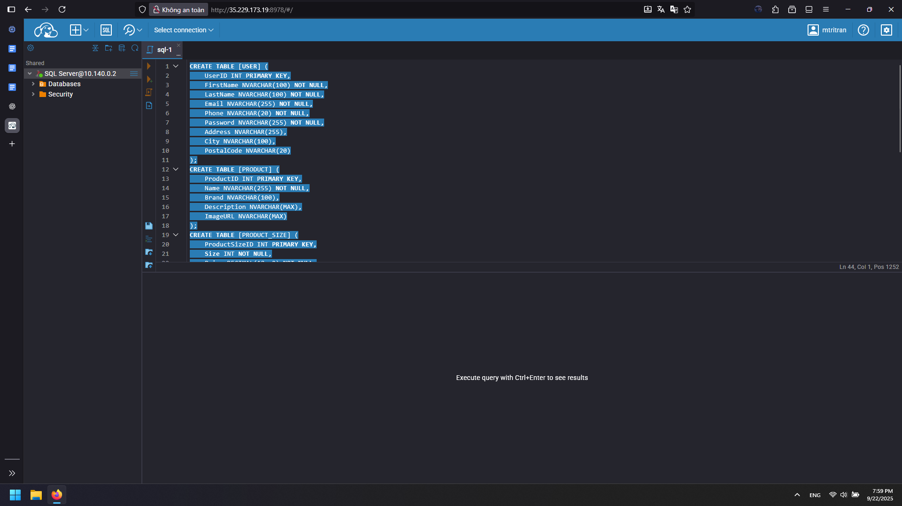
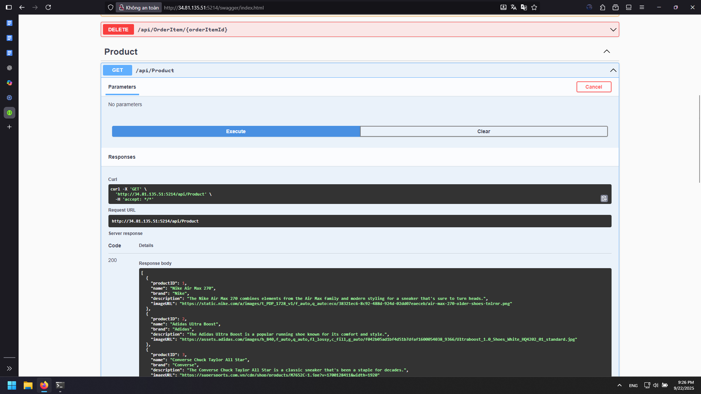

# E-commerce Fullstack Project Deployment With Docker

## Overview

Complete deployment guide for E-commerce Fullstack project using .NET Core 6 Backend, React Frontend, SQL Server database with Docker containerization.

## 1. Create Servers

Create two servers with the following configurations:

- Database Server: 2 GB RAM, 20 GB SSD, hosting SQL Server and CloudBeaver, allowing ports 1433 and 8978.
- Deploy Server: 4 GB RAM, 20 GB SSD, hosting application containers and reverse proxy for static IP.

Ensure firewall rules and network security settings are properly configured for each server according to its role.

## 2. Install Docker, SQL Server and CloudBeaver

### a. Install Docker on Database Server

Create docker installation script:
```bash
root@database-server:~# nano docker-install.sh
root@database-server:~# cat docker-install.sh
#!/bin/bash
sudo apt install -y apt-transport-https ca-certificates curl software-properties-common
curl -fsSL https://download.docker.com/linux/ubuntu/gpg | sudo gpg --dearmor -o /usr/share/keyrings/docker-archive-keyring.gpg
echo "deb [signed-by=/usr/share/keyrings/docker-archive-keyring.gpg] https://download.docker.com/linux/ubuntu $(lsb_release -cs) stable" | sudo tee /etc/apt/sources.list.d/docker.list > /dev/null
sudo apt update -y
sudo apt install docker-ce -y
sudo systemctl start docker
sudo systemctl enable docker
sudo curl -L "https://github.com/docker/compose/releases/latest/download/docker-compose-$(uname -s)-$(uname -m)" -o /usr/local/bin/docker-compose
sudo chmod +x /usr/local/bin/docker-compose
docker -v
docker-compose -v

root@database-server:~# chmod +x docker-install.sh
root@database-server:~# sh docker-install.sh
```

### b. Install SQL Server with Docker

```bash
root@database-server:~# mkdir -p /tools/sqlserver
root@database-server:~# cd /tools/sqlserver/
root@database-server:/tools/sqlserver# nano docker-compose.yml
```

**docker-compose.yml content:**
```yaml
version: '3.8'

services:
  sqlserver:
    image: mcr.microsoft.com/mssql/server
    container_name: sqlserver
    restart: always
    ports:
      - "1433:1433"
    environment:
      ACCEPT_EULA: "Y"
      SA_PASSWORD: "Str0ngPa5sVvorcl"
    volumes:
      - sqlserver-data:/var/opt/mssql

volumes:
  sqlserver-data:
    driver: local
```

```bash
root@database-server:/tools/sqlserver# docker-compose up -d
```

### c. Install CloudBeaver

```bash
root@database-server:/tools/sqlserver# cd ..
root@database-server:/tools# mkdir cloudbeaver
root@database-server:/tools# cd cloudbeaver/
root@database-server:/tools/cloudbeaver# nano docker-compose.yml
```

**docker-compose.yml content:**
```yaml
version: '3.8'
services:
  cloudbeaver:
    image: dbeaver/cloudbeaver
    container_name: cloudbeaver
    restart: always
    ports:
      - "8978:8978"
    volumes:
      - cloudbeaver-data:/opt/cloudbeaver/workspace

volumes:
  cloudbeaver-data:
    driver: local
```

```bash
root@database-server:/tools/cloudbeaver# docker-compose up -d
root@database-server:/tools/cloudbeaver# docker ps -a
```

**Create firewall rules for CloudBeaver port 8978 and SQL Server port 1433**

### Create OnlineShopDB Database

Install SQL Server command line tools:
```bash
root@database-server:/tools/cloudbeaver# curl https://packages.microsoft.com/keys/microsoft.asc | sudo apt-key add -
root@database-server:/tools/cloudbeaver# sudo add-apt-repository "$(curl https://packages.microsoft.com/config/ubuntu/22.04/prod.list)"
root@database-server:/tools/cloudbeaver# sudo apt-get update
root@database-server:/tools/cloudbeaver# sudo apt-get install -y mssql-tools unixodbc-dev
root@database-server:/tools/cloudbeaver# docker inspect sqlserver | grep -i password
root@database-server:/tools/cloudbeaver# /opt/mssql-tools/bin/sqlcmd -S 127.0.0.1 -U sa -P 'Str0ngPa5sVvorcl'
1> create database OnlineShopDB
2> GO
1> exit
```

### Configure CloudBeaver Web Interface

1. Access CloudBeaver: `http://[database_server_public_ip]:8978`


2. Set username and password, then click Next > Finish

3. Login to the interface

4. Click the logo in top left to go to homepage

5. Click connection icon next to logo > New Connection


6. Select SQL Server


7. Enter connection details:
   - Host: Internal IP of database-server
   - Port: SQL Server docker port (1433)
   - Database: OnlineShopDB
   - Username: sa
   - Password: Str0ngPa5sVvorcl


8. Click Test (should show green checkmark), then Create


### Create Tables and Import Data

1. Click on SQL tab


2. Select the last icon from top in left column to upload SQL script


3. Choose table-init.sql first to create tables


4. Select all script (Ctrl + A) and run (Ctrl + Enter)



5. Do the same for data-init.sql


6. After import: click 3 lines of SQL Server > Refresh to verify tables and data


## 3. Deploy Project with Docker

Open project in VS Code, click search icon, copy old IP to top field and new IP to bottom field to replace.

**In appsettings.json**: Replace database path with private IP of database server


**Next**: Replace old deploy server IP with current deploy server public IP


### Prepare Project Files

1. Compress project folder to ZIP file
2. Move to the directory containing zipped project folder
3. Open terminal in that directory and run:

```bash
PS D:\Users\Devops Engineer\Desktop> scp .\ecommerce-fullstack-netcore-react.zip deploy:/home/mtritran
```

Verify on deploy server:
```bash
root@deploy-server:/home# cd /home/mtritran/
root@deploy-server:/home/mtritran# ls
ecommerce-fullstack-netcore-react.zip
```

### d. Create User and Assign Permissions

```bash
root@deploy-server:~# adduser onlineshop
root@deploy-server:~# usermod -aG docker onlineshop
root@deploy-server:~# su - onlineshop
onlineshop@deploy-server:~$ groups onlineshop
onlineshop : onlineshop docker
```

### e. Create Storage Folder and Extract

```bash
root@deploy-server:~# mkdir -p /home/onlineshop/projects
root@deploy-server:~# mv /home/mtritran/ecommerce-fullstack-netcore-react.zip /home/onlineshop/projects/
root@deploy-server:~# ls /home/onlineshop/projects/
ecommerce-fullstack-netcore-react.zip
root@deploy-server:~# chown -R onlineshop:onlineshop /home/onlineshop/projects

root@deploy-server:~# su onlineshop
onlineshop@deploy-server:/root$ cd /home/onlineshop/projects/
onlineshop@deploy-server:~/projects$ apt install -y unzip
onlineshop@deploy-server:~/projects$ unzip ecommerce-fullstack-netcore-react.zip

# Verify content
onlineshop@deploy-server:~/projects$ ls
ecommerce-fullstack-netcore-react ecommerce-fullstack-netcore-react.zip
```

### f. Install Docker on Deploy Server

```bash
root@deploy-server:/home/mtritran/projects# cd
root@deploy-server:~# nano docker-install.sh
```

Same docker installation script as database server.

```bash
root@deploy-server:~# chmod +x docker-install.sh
root@deploy-server:~# ./docker-install.sh
root@deploy-server:~# rm docker-install.sh
```

## 4. Write Dockerfile and Deploy Backend

```bash
root@deploy-server:~# cd /home/mtritran/projects/ecommerce-fullstack-netcore-react/
root@deploy-server:/home/mtritran/projects/ecommerce-fullstack-netcore-react# su onlineshop
onlineshop@deploy-server:/home/mtritran/projects/ecommerce-fullstack-netcore-react$ ls
README.md backend data-init.sql frontend table-init.sql
onlineshop@deploy-server:/home/mtritran/projects/ecommerce-fullstack-netcore-react$ cd backend/

onlineshop@deploy-server:/home/mtritran/projects/ecommerce-fullstack-netcore-react/backend$ nano Dockerfile
```

**Backend Dockerfile:**
```dockerfile
# Use .NET SDK (dev/test)
FROM mcr.microsoft.com/dotnet/sdk:6.0
# Work in /app
WORKDIR /app
# 1) Copy csproj first to cache restore
COPY *.csproj ./
RUN dotnet restore
# 2) Copy all source and build
COPY . .
RUN dotnet build -c Release
# 3) Environment variables & port
ENV ASPNETCORE_URLS=http://0.0.0.0:5214 \
    ASPNETCORE_ENVIRONMENT=Development \
    DOTNET_EnableDiagnostics=0
EXPOSE 5214
# 4) Run app (quick test)
CMD ["dotnet", "run", "-c", "Release"]
```

### Build and Run Backend

```bash
onlineshop@deploy-server:/home/mtritran/projects/ecommerce-fullstack-netcore-react/backend$ docker build -t online-shop-backend .
onlineshop@deploy-server:/home/mtritran/projects/ecommerce-fullstack-netcore-react/backend$ docker run -d --name online-shop-backend -p 5214:5214 --restart=always online-shop-backend
onlineshop@deploy-server:/home/mtritran/projects/ecommerce-fullstack-netcore-react/backend$ docker ps
```

**Create firewall rule for port 5214**

Access: `http://[deploy_server_external_ip]:5214/swagger`


Test API requests to verify functionality.



## 5. Write Dockerfile and Deploy Frontend

```bash
onlineshop@deploy-server:/home/mtritran/projects/ecommerce-fullstack-netcore-react/backend$ cd ..
onlineshop@deploy-server:/home/mtritran/projects/ecommerce-fullstack-netcore-react$ cd frontend/
onlineshop@deploy-server:/home/mtritran/projects/ecommerce-fullstack-netcore-react/frontend$ nano Dockerfile
```

**Frontend Dockerfile:**
```dockerfile
FROM node:18-alpine
WORKDIR /app
# 1) cache install
COPY package*.json ./
RUN npm ci --prefer-offline --no-audit --progress=false
# 2) copy source
COPY . .
# For CRA/Vite bind outside
ENV HOST=0.0.0.0 \
    PORT=3000 \
    CI=true
EXPOSE 3000
# Dev server for quick test
CMD ["npm", "start"]
```

### Build and Run Frontend

```bash
onlineshop@deploy-server:/home/mtritran/projects/ecommerce-fullstack-netcore-react/frontend$ docker build -t online-shop-frontend .
onlineshop@deploy-server:/home/mtritran/projects/ecommerce-fullstack-netcore-react/frontend$ docker run -d --name online-shop-frontend -p 3000:3000 --restart=always online-shop-frontend
onlineshop@deploy-server:/home/mtritran/projects/ecommerce-fullstack-netcore-react/frontend$ docker ps -a
```

**Open port 3000 for frontend**

Access: `http://[deploy_server_external_ip]:3000`


## 6. Final Verification

1. Access Swagger API: `http://[deploy_server_external_ip]:5214/swagger`
2. Get account information from Swagger


3. Copy email and password to login to frontend


4. Test adding products to cart functionality


5. Verify all features are working properly

## Port Summary

- **1433**: SQL Server
- **8978**: CloudBeaver management
- **5214**: Backend API
- **3000**: Frontend application

## Security Notes

- Change default SA password for production
- Configure firewall rules appropriately
- Use environment variables for sensitive data
- Regular backup of database
- Monitor container logs for issues
- Using load balancer(Nginx,...) instead of using public ip of Deploy Server