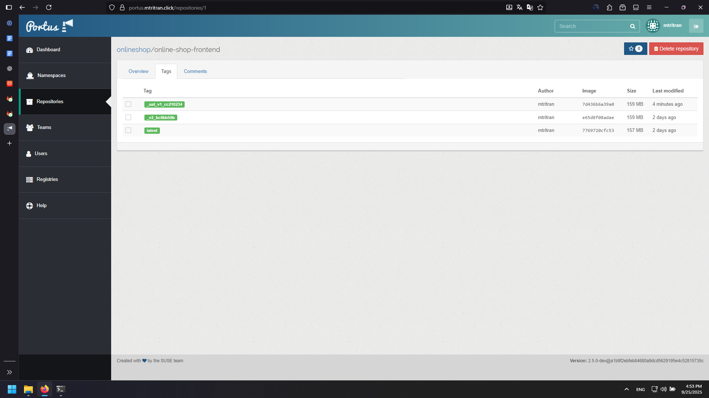
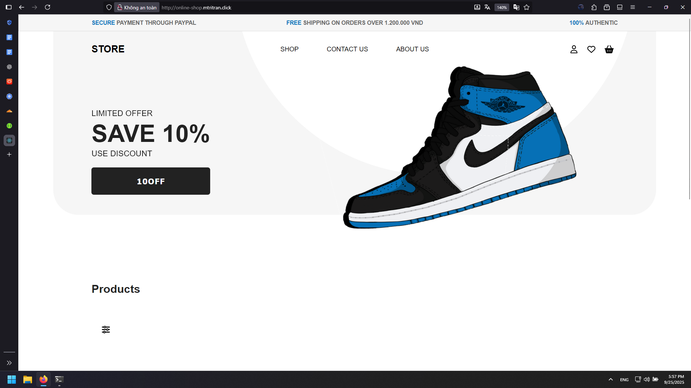

# Full-Stack Application Deployment on Kubernetes

## Overview

This guide demonstrates deploying a complete full-stack application (frontend + backend) on Kubernetes using proper container orchestration practices with private registry integration.

## 1. Application Configuration Analysis

### Identify Configuration Files

Before deployment, analyze application configuration files:


**Backend Files (Development Only):**
- `launchSettings.json`: IIS Express/localhost configuration
- `applicationhost.config`: IIS configuration
- **Action:** No changes needed (used only for local development)

**Frontend Files (Requires Update):**
- `bundle.js`: Contains API base URL references
- `variables.js`: API configuration variables
- **Action:** Must update API endpoints for Kubernetes deployment

### Frontend Configuration Updates

**Required Changes:**
- Change from: `http://<dev-server-ip>:5214`
- Change to: `http://api-online-shop.mtritran.click`


This ensures frontend can communicate with backend through Kubernetes ingress.

## 2. Build and Push Container Images

### Create UAT Branches

1. Create `UAT` branch from existing pipeline branches
2. Update frontend configuration files
3. Commit changes to UAT branches

### CI/CD Pipeline Configuration

**Pipeline for both Frontend and Backend:**

```yaml
variables:
  USER_PROJECT: "onlineshop"
  IMAGE_VERSION: "${CI_REGISTRY}/${USER_PROJECT}/${CI_PROJECT_NAME}:${CI_COMMIT_BRANCH}_${CI_COMMIT_TAG}_${CI_COMMIT_SHORT_SHA}"

stages:
  - build
  - push

build:
  stage: build
  variables:
    GIT_STRATEGY: clone
  script:
    - docker build -t $IMAGE_VERSION .
  tags:
    - online-shop-runner-build-shell
  only:
    - tags

push:
  stage: push
  variables:
    GIT_STRATEGY: none
  before_script:
    - echo "$CI_REGISTRY_PASSWORD" | docker login -u "$CI_REGISTRY_USER" $CI_REGISTRY --password-stdin
  script:
    - docker push $IMAGE_VERSION
  after_script:
    - docker logout $CI_REGISTRY || true
  tags:
    - online-shop-runner-build-shell
  only:
    - tags
```

### Create Git Tags

Create tags for both projects to trigger pipeline builds:
- Backend: Results in image `portus.mtritran.click/onlineshop/online-shop-backend:_uat_v1_<hash>`


- Frontend: Results in image `portus.mtritran.click/onlineshop/online-shop-frontend:_uat_v1_<hash>`



## 3. Configure Kubernetes Registry Access

### Create Namespace and Registry Secret

```bash
# Create dedicated namespace
kubectl create ns online-shop

# Create docker registry secret
kubectl create secret docker-registry auth-registry \
  --docker-server=portus.mtritran.click \
  --docker-username=<username> \
  --docker-password=<password> \
  -n online-shop
```

### Verify Secret Creation

```bash
kubectl get secret auth-registry -n online-shop -o jsonpath='{.data.*}' | base64 -d
```

Verify the secret appears in Kubernetes Dashboard under Config and Storage → Secrets.


## 4. Deploy Backend Application

- We will implement the project according to this scheme:


### Backend Deployment

```yaml
apiVersion: apps/v1
kind: Deployment
metadata:
  name: online-shop-backend-deployment
  labels:
    app: online-shop-backend
  namespace: online-shop
spec:
  replicas: 1
  selector:
    matchLabels:
      app: online-shop-backend
  template:
    metadata:
      labels:
        app: online-shop-backend
    spec:
      containers:
      - name: online-shop-backend
        image: portus.mtritran.click/onlineshop/online-shop-backend:_uat_v1_<hash>
        ports:
        - containerPort: 5214
        resources:
          requests:
            memory: 256Mi
      imagePullSecrets:
      - name: auth-registry
```

### Backend Service

```yaml
apiVersion: v1
kind: Service
metadata:
  name: online-shop-backend-service
  namespace: online-shop
spec:
  selector:
    app: online-shop-backend
  ports:
  - protocol: TCP
    port: 5214
    targetPort: 5214
```

### Backend Ingress

```yaml
apiVersion: networking.k8s.io/v1
kind: Ingress
metadata:
  name: online-shop-backend-ingress
  namespace: online-shop
spec:
  ingressClassName: nginx
  rules:
  - host: api-online-shop.mtritran.click
    http:
      paths:
      - path: /
        pathType: Prefix
        backend:
          service:
            name: online-shop-backend-service
            port:
              number: 5214
```

### Configure DNS for Backend

Add DNS record in Cloudflare:
- Name: `api-online-shop`
- IPv4 address: Load Balancer static IP
- Proxy status: DNS only (gray cloud)


### Verify Backend Deployment

Access: `http://api-online-shop.mtritran.click/swagger/index.html`


## 5. Deploy Frontend Application

### Complete Frontend Deployment

```yaml
apiVersion: apps/v1
kind: Deployment
metadata:
  name: online-shop-frontend
  namespace: online-shop
spec:
  replicas: 1
  selector:
    matchLabels:
      app: online-shop-frontend
  template:
    metadata:
      labels:
        app: online-shop-frontend
    spec:
      containers:
      - name: online-shop-frontend
        image: portus.mtritran.click/onlineshop/online-shop-frontend:_uat_v1_<hash>
        ports:
        - containerPort: 3000
          protocol: TCP
        resources:
          requests:
            memory: 256Mi
      imagePullSecrets:
      - name: auth-registry

---
apiVersion: v1
kind: Service
metadata:
  name: online-shop-frontend-service
  namespace: online-shop
spec:
  selector:
    app: online-shop-frontend
  ports:
  - port: 3000
    targetPort: 3000
    protocol: TCP

---
apiVersion: networking.k8s.io/v1
kind: Ingress
metadata:
  name: online-shop-frontend-ingress
  namespace: online-shop
spec:
  ingressClassName: nginx
  rules:
  - host: online-shop.mtritran.click
    http:
      paths:
      - path: /
        pathType: Prefix
        backend:
          service:
            name: online-shop-frontend-service
            port:
              number: 3000
```

### Configure DNS for Frontend

Add DNS record in Cloudflare:
- Name: `online-shop`
- IPv4 address: Load Balancer static IP
- Proxy status: DNS only (gray cloud)


### Verify Frontend Deployment

Access: `http://online-shop.mtritran.click/`



## 6. Architecture Overview

### Application Flow

```
User → Cloudflare DNS → Load Balancer → Kubernetes Ingress → Services → Pods
```

### Service Communication

```
Frontend (online-shop.mtritran.click) → API calls → Backend (api-online-shop.mtritran.click)
```

### Container Registry Flow

```
GitLab CI/CD → Build Images → Push to Portus → Kubernetes pulls with imagePullSecrets
```

## 7. Key Configuration Elements

### Namespace Isolation
- All resources deployed in `online-shop` namespace
- Isolated from other applications
- Dedicated registry secrets

### Private Registry Integration
- Docker registry secret for authenticated pulls
- Images stored in private Portus registry
- Secure image distribution

### Ingress Routing
- Host-based routing for frontend and backend
- Single load balancer serving multiple applications
- SSL termination at ingress level

### Resource Management
- Memory requests defined for containers
- Horizontal scaling capability
- Health check integration

## 8. Production Considerations

### Security
- Use proper RBAC for namespace access
- Implement network policies
- Secure registry credentials management

### Scaling
- Configure horizontal pod autoscaling
- Monitor resource utilization
- Plan for database scaling

### Monitoring
- Implement logging aggregation
- Set up application metrics
- Configure alerting for service health

### High Availability
- Multi-replica deployments
- Rolling update strategies
- Database replication and backup

This deployment demonstrates a complete full-stack application running on Kubernetes with proper service discovery, ingress routing, and private container registry integration.