# GitLab CI/CD And GitLab Runner Setup

## Overview

This guide sets up a complete CI/CD pipeline using GitLab with dedicated build and deployment servers for an online shop project.

## 1. Infrastructure Setup

### Create Required Servers

**GitLab Server:**
- **Machine type:** e2-standard-2 (2 vCPU, 8 GB RAM)
- **Storage:** 20 GB SSD
- **Zone:** asia-east1 (Taiwan)
- **Purpose:** Host GitLab instance

**Build Server:**
- **Machine type:** e2-medium (2 vCPU, 4 GB RAM)
- **Storage:** 20 GB SSD  
- **Zone:** asia-east1 (Taiwan)
- **Purpose:** Build and test applications

### Configure Static IP and DNS

1. **Convert GitLab server IP to static:**
   - Go to VPC Network > IP addresses > External IP addresses
   - Change GitLab server IP from "Ephemeral" to "Static"

2. **Add DNS record in Cloudflare:**
   - Name: `gitlab`
   - IPv4 address: GitLab server static IP
   - Proxy status: DNS only (gray cloud)

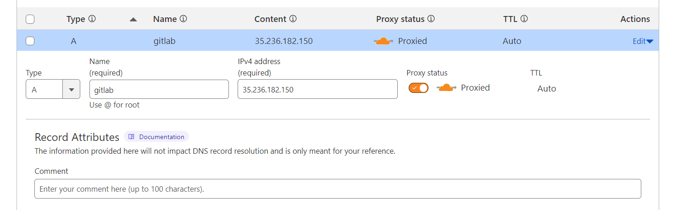

## 2. Install GitLab

SSH into the GitLab server and run:

```bash
sudo -i
curl -s https://packages.gitlab.com/install/repositories/gitlab/gitlab-ee/script.deb.sh | sudo bash
sudo apt-get install gitlab-ee=15.5.0-ee.0
```

### Configure GitLab

```bash
nano /etc/gitlab/gitlab.rb
```

Edit the external URL:
```ruby
external_url 'http://gitlab.mtritran.click'
```

Apply configuration:
```bash
sudo gitlab-ctl reconfigure
gitlab-ctl status
```

### Optimize GitLab (Optional)

Stop unnecessary services to save resources:
```bash
gitlab-ctl stop alertmanager
gitlab-ctl stop gitlab-kas
gitlab-ctl stop node-exporter
```

### Get Initial Password

```bash
cat /etc/gitlab/initial_root_password
```

## 3. Access GitLab

1. Open http://gitlab.mtritran.click in browser

2. Login credentials:
   - Username: `root`
   - Password: Use password from previous step

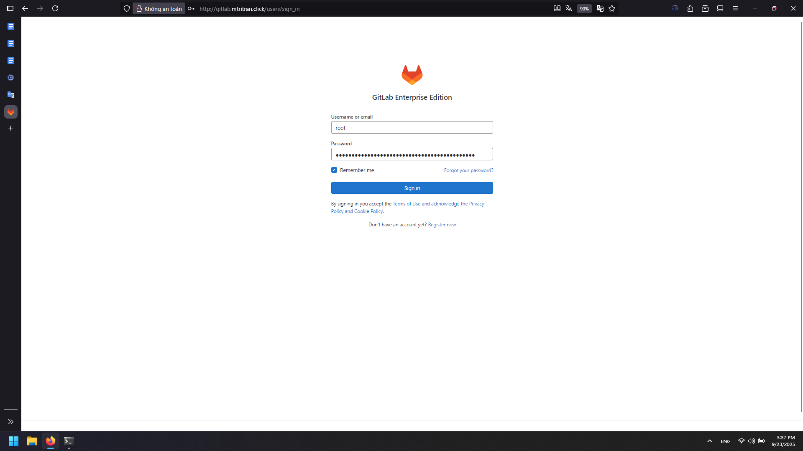

## 4. Project Organization

### Create Group

1. Click the hamburger menu (three lines)

2. Select "Groups" → "Create group"

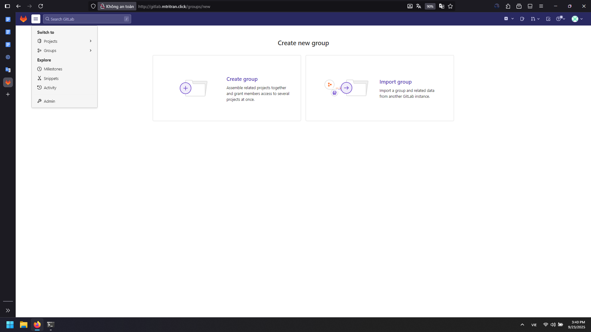

3. Group settings:
   - **Name:** onlineshop
   - **Visibility:** Private
   - **Role:** Developer/DevOps Engineer

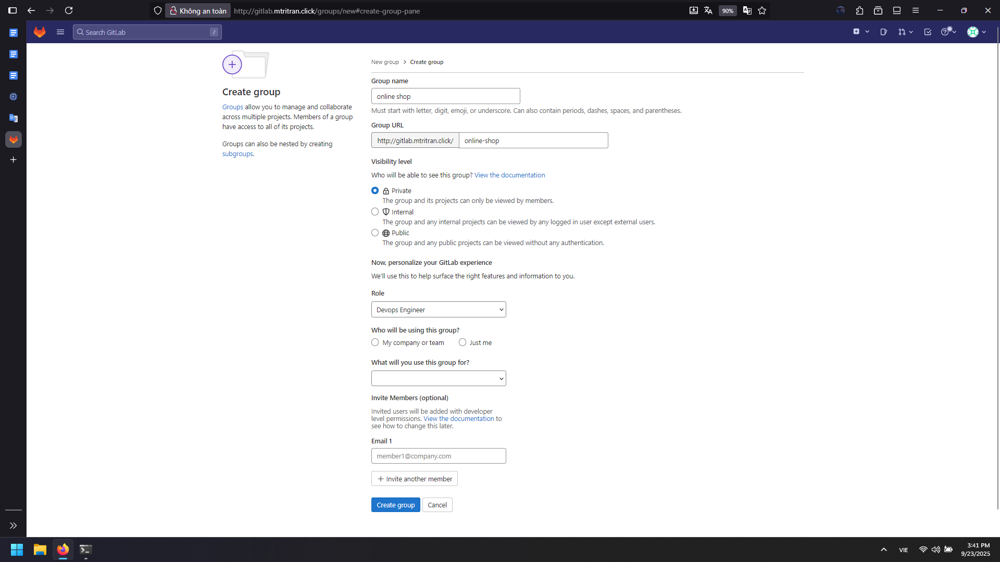   

### Create Projects

Create two projects within the group:

**Frontend Project:**
1. Click "Create new project"

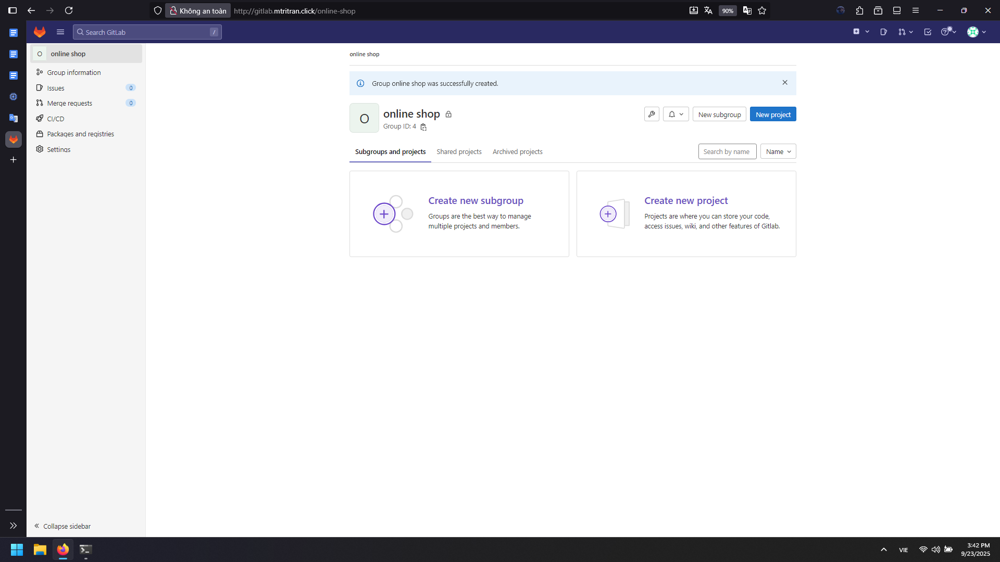

2. Select "Create blank project"

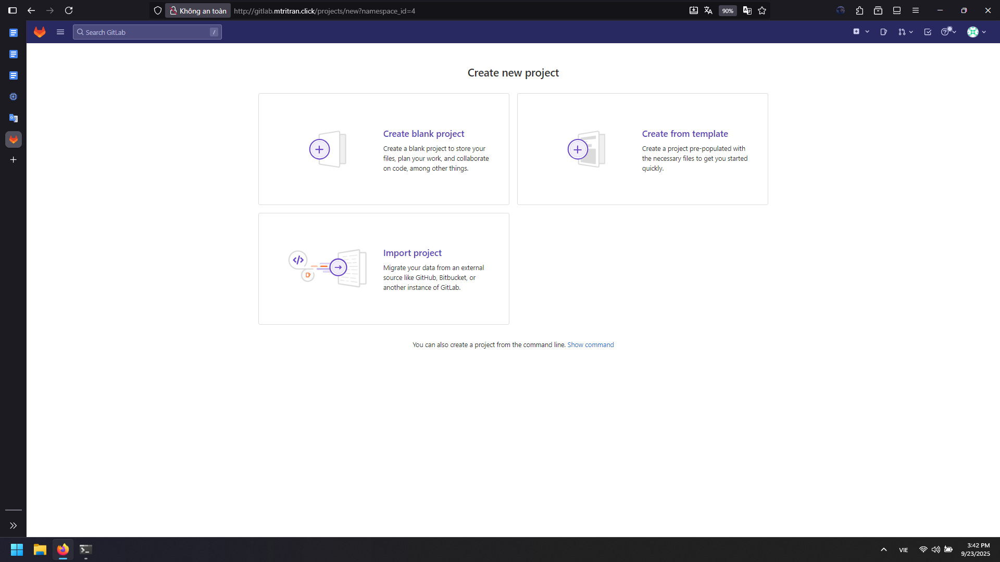

3. Project name: `online-shop-frontend`

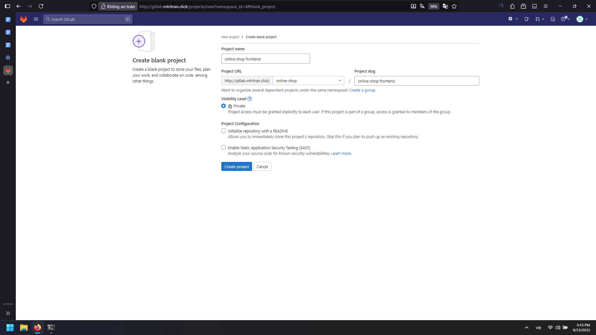

4. Set visibility to Private

**Backend Project:**
1. Repeat the process
2. Project name: `online-shop-backend`


3. Set visibility to Private

## 5. Local Development Setup

### Clone Projects

Create local workspace:
```bash
mkdir onlineshop
cd onlineshop
```

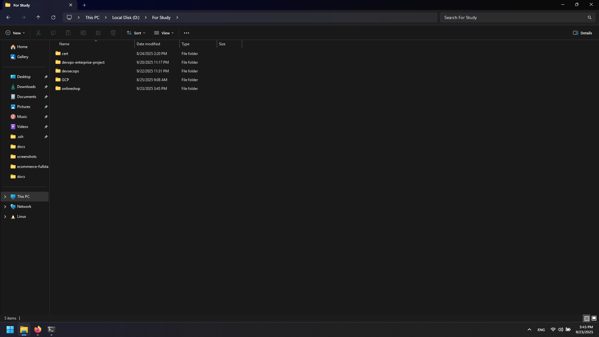

Clone both projects:
```bash
# Clone backend
git clone http://gitlab.mtritran.click/online-shop/online-shop-backend.git

# Clone frontend  
git clone http://gitlab.mtritran.click/online-shop/online-shop-frontend.git
```

When prompted, enter:
- Username: `root`
- Password: GitLab root password

### Add Source Code

1. Copy your backend source code into `online-shop-backend/` directory
2. Copy your frontend source code into `online-shop-frontend/` directory

### Push Code to GitLab

For each project directory:
```bash
cd online-shop-backend/
git status
git add .
git commit -m "add project"
git push

cd ../online-shop-frontend/
git status
git add .
git commit -m "add project"
git push
```

## 6. Install GitLab Runners

### Install Runner on Build Server

SSH into both build and deployment servers and run:

```bash
apt update -y
curl -L "https://packages.gitlab.com/install/repositories/runner/gitlab-runner/script.deb.sh" | sudo bash
apt install gitlab-runner
gitlab-runner --version
```

### Get Registration Token

1. In GitLab, navigate to the onlineshop group

2. Go to Settings → CI/CD → Runners

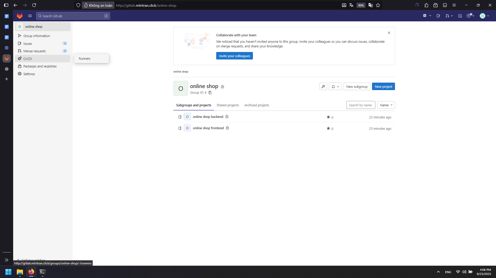

3. Find "Register a group runner" section

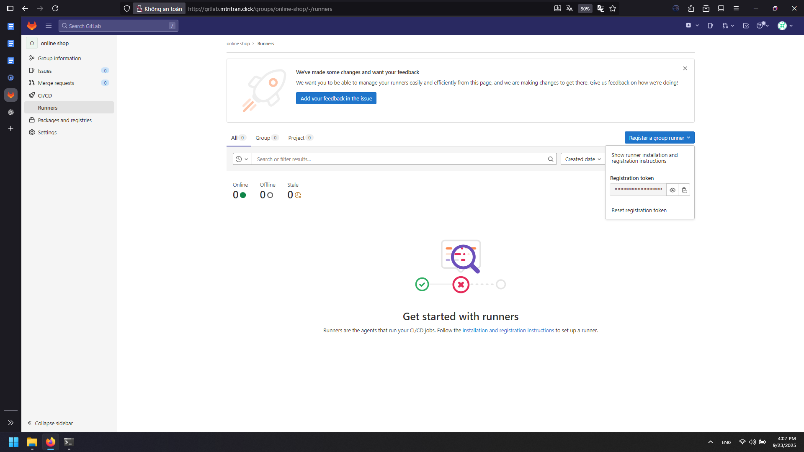

4. Copy the registration token

### Register Runners

On each server, run:
```bash
gitlab-runner register
```

**Registration prompts:**

1. **GitLab instance URL:**
   ```
   http://gitlab.mtritran.click/
   ```

2. **Registration token:**
   ```
   <paste-the-token-from-gitlab>
   ```

3. **Runner description:**
   - Build server: `online-shop-runner-build-shell`
   - Deploy server: `online-shop-runner-deploy-shell`

4. **Runner tags:**
   - Build server: `online-shop-runner-build-shell`
   - Deploy server: `online-shop-runner-deploy-shell`

5. **Maintenance note:** (Press Enter to skip)

6. **Executor:** `shell`

### Configure Runner Concurrency

Edit runner configuration:
```bash
nano /etc/gitlab-runner/config.toml
```

Update concurrent setting:
```toml
concurrent = 4
```

This allows up to 4 runners to execute simultaneously.

## 7. Verify Setup

### Check Runners Status

1. In GitLab, go to Group → Settings → CI/CD → Runners
2. Refresh the page
3. Verify both runners show as "Online"

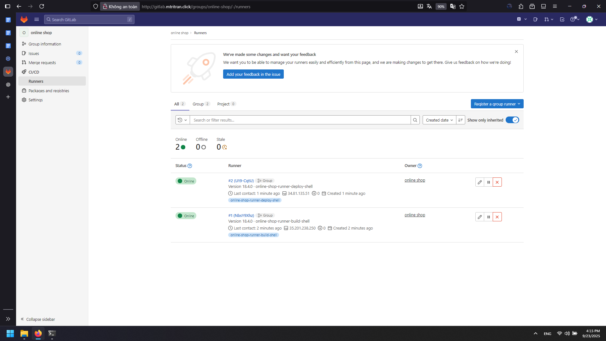

### Project Structure

Your GitLab group should now contain:
- `online-shop-backend` project with source code
- `online-shop-frontend` project with source code
- Two registered runners (build and deploy)

## Next Steps

With this setup complete, you can now:
1. Create `.gitlab-ci.yml` files in each project
2. Define build, test, and deployment pipelines
3. Implement automated CI/CD workflows
4. Set up environment-specific deployments

The infrastructure is now ready for implementing complete CI/CD pipelines for your online shop application.