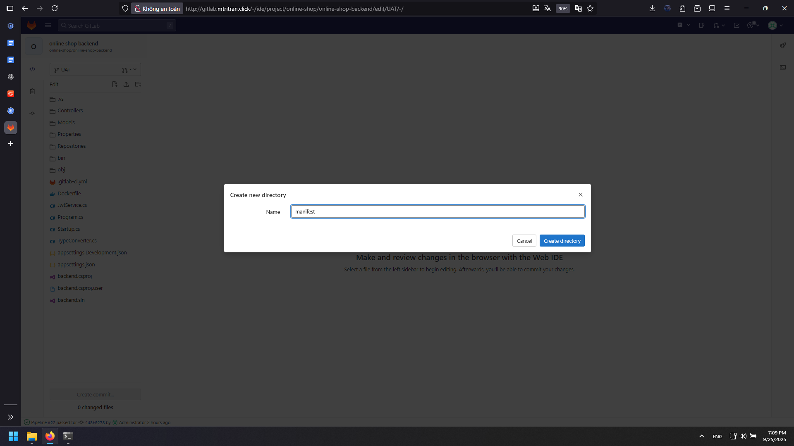
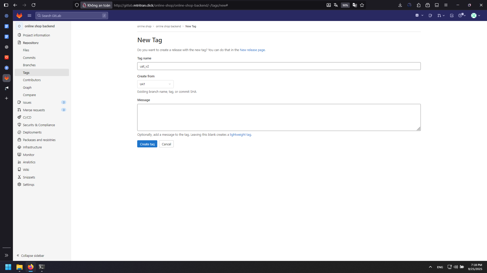
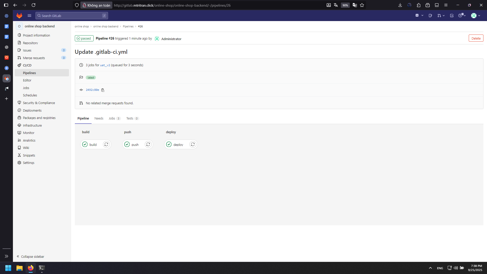
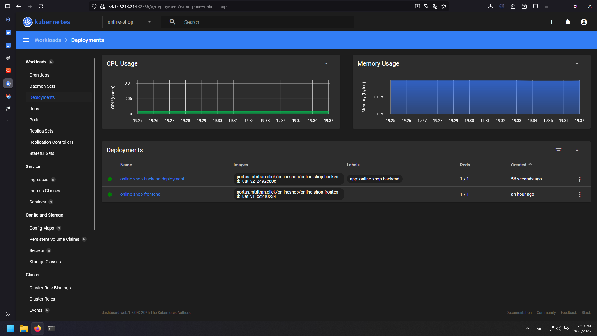
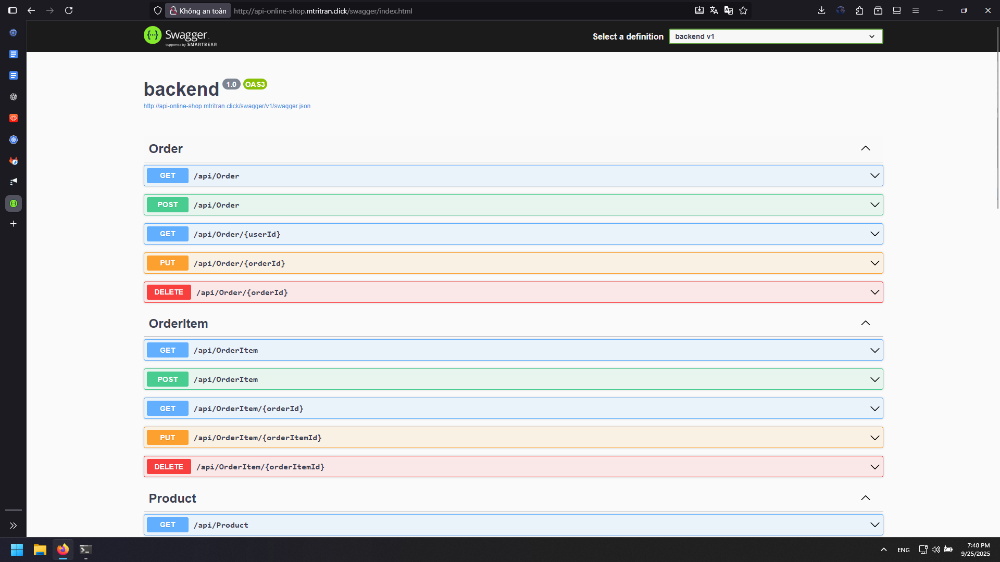

# CI/CD Pipeline on Kubernetes with GitLab Runner (Shell Executor)
*Structured in the same Markdown style as before.*

---

## Goals
- Install and register a **GitLab Runner** on a Kubernetes master node (shell executor).
- Build, push, and deploy the **online-shop-backend** image via GitLab CI/CD.
- Template the Deployment manifest with a dynamic image tag and apply to the cluster.

---

## Prerequisites
- A reachable self-hosted GitLab instance (e.g., `http://gitlab.mtritran.click/`).
- A Kubernetes cluster with working `kubectl` context from the runner host.
- Docker available on the runner host to build and push images.
- A container registry (with `CI_REGISTRY`, `CI_REGISTRY_USER`, `CI_REGISTRY_PASSWORD` available in project/group CI/CD variables).
- Namespace `online-shop` created in the cluster and `imagePullSecrets: auth-registry` available if the registry is private.

---

## High-Level Architecture
```
Developer push/tag  --->  GitLab CI/CD Pipelines  --->  Build & Push Image  --->  kubectl apply to K8s
                               |                                               ^
                               v                                               |
                          GitLab Runner (Shell)  -------------------------------
```

**Flow:** A tag push triggers the pipeline. The runner builds the image, pushes it to the registry, rewrites the Deployment manifest image field, and applies it to the cluster.

---

## 1) Install GitLab Runner (Debian/Ubuntu)
On a Kubernetes control plane node (e.g., `k8s-master-1`):
```bash
curl -L "https://packages.gitlab.com/install/repositories/runner/gitlab-runner/script.deb.sh" | sudo bash
sudo apt install -y gitlab-runner
```

(Optional) Ensure hostnames resolve correctly:
```bash
sudo nano /etc/hosts
<ip private of gitlab server> gitlab-server
```

---

## 2) Register the Runner (Shell Executor)
Obtain the **registration token** from **Group > Settings > CI/CD > Runners** in GitLab. Then run:
```bash
curl -L "https://packages.gitlab.com/install/repositories/runner/gitlab-runner/script.deb.sh" | sudo bash
apt install gitlab-runner
sudo gitlab-runner register
```
Provide the following answers:
- **GitLab instance URL:** `http://gitlab.mtritran.click/`
- **Registration token:** `<GROUP_RUNNER_TOKEN>`
- **Description:** `k8s-master-1-shell`
- **Tags:** `k8s-master-1-shell`
- **Executor:** `shell`

If successful, the runner will auto-reload its config.

---

## 3) Create Kubernetes Deployment Manifest
In the **UAT branch** of the backend project, open **Web IDE** and create the folder `manifest/` and the file `manifest/online-shop-backend-deployment.yaml`:



```yaml
apiVersion: apps/v1
kind: Deployment
metadata:
  name: online-shop-backend-deployment
  labels:
    app: online-shop-backend
  namespace: online-shop
spec:
  replicas: 1
  selector:
    matchLabels:
      app: online-shop-backend
  template:
    metadata:
      labels:
        app: online-shop-backend
    spec:
      containers:
        - name: online-shop-backend
          image: dynamic_image
          ports:
            - containerPort: 5214
          resources:
            requests:
              memory: 256Mi
      imagePullSecrets:
        - name: auth-registry
```

> The placeholder `dynamic_image` will be replaced during the deploy stage.

---

## 4) Define the GitLab CI Pipeline
Create or update `.gitlab-ci.yml` in the same project/branch:

```yaml
variables:
  USER_PROJECT: "onlineshop"
  IMAGE_VERSION: "${CI_REGISTRY}/${USER_PROJECT}/${CI_PROJECT_NAME}:${CI_COMMIT_BRANCH}_${CI_COMMIT_TAG}_${CI_COMMIT_SHORT_SHA}"

stages:
  - build
  - push
  - deploy

build:
  stage: build
  variables:
    GIT_STRATEGY: clone
  script:
    - docker build -t $IMAGE_VERSION .
  tags:
    - online-shop-runner-build-shell
  only:
    - tags

push:
  stage: push
  variables:
    GIT_STRATEGY: none
  before_script:
    - echo "$CI_REGISTRY_PASSWORD" | docker login -u "$CI_REGISTRY_USER" $CI_REGISTRY --password-stdin
  script:
    - docker push $IMAGE_VERSION
  after_script:
    - docker logout $CI_REGISTRY || true
  tags:
    - online-shop-runner-build-shell
  only:
    - tags

deploy:
  stage: deploy
  variables:
    GIT_STRATEGY: clone
  script:
    - sed -i "s|dynamic_image|$IMAGE_VERSION|" ./manifest/online-shop-backend-deployment.yaml
    - kubectl apply -f ./manifest/online-shop-backend-deployment.yaml
  tags:
    - k8s-master-1-shell
  only:
    - tags
```

**Notes**
- The pipeline runs only on **tagged commits**.
- `sed` replaces the image placeholder with the dynamically computed `$IMAGE_VERSION`.
- The runner host must have `kubectl` configured and authorized to apply to the target cluster namespace.

---

## 5) Grant `kubectl` Access to the Runner
If you registered the runner under the `gitlab-runner` system user, copy the kubeconfig to the runner’s home and fix ownership:
```bash
ls -lat
sudo cp -rf ~/.kube/ /home/gitlab-runner/
sudo chown -R gitlab-runner. /home/gitlab-runner/ ~/.kube/
ls -lat /home/gitlab-runner
```

> Ensure the kubeconfig context points to the correct cluster and namespace (`online-shop`).

---

## 6) Trigger the Pipeline
- Commit & push changes.
- **Create a Git tag** and push the tag to start the pipeline.



Once the pipeline finishes:



- Verify Deployment creation and Pod status:




- Access the API:
  - Swagger UI: `http://api-online-shop.mtritran.click/swagger/index.html`



---

## 7) Verification & Observability
- Confirm a Pod for `online-shop-backend` exists and is **Running**.
- Review the pipeline logs in GitLab for the **build**, **push**, and **deploy** jobs.
- If the image is private, confirm `imagePullSecrets: auth-registry` works (no `ImagePullBackOff`).

---

## Security Considerations
- Avoid storing plaintext credentials. Use GitLab CI/CD **masked and protected** variables for registry credentials and kubeconfig secrets.
- Prefer a least-privilege ServiceAccount and `kubectl --token` workflows in production.
- Limit runner tags and protect the pipeline to **protected branches/tags** if necessary.

