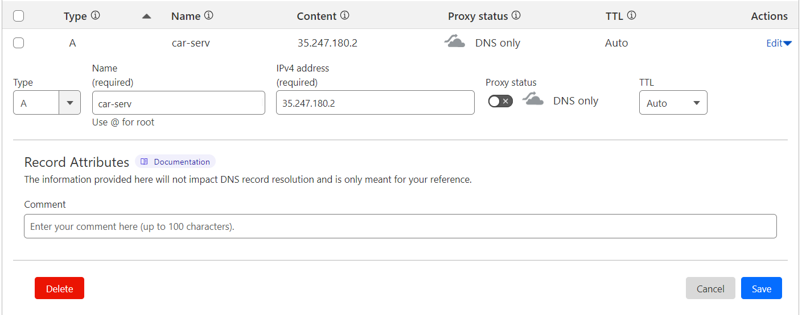
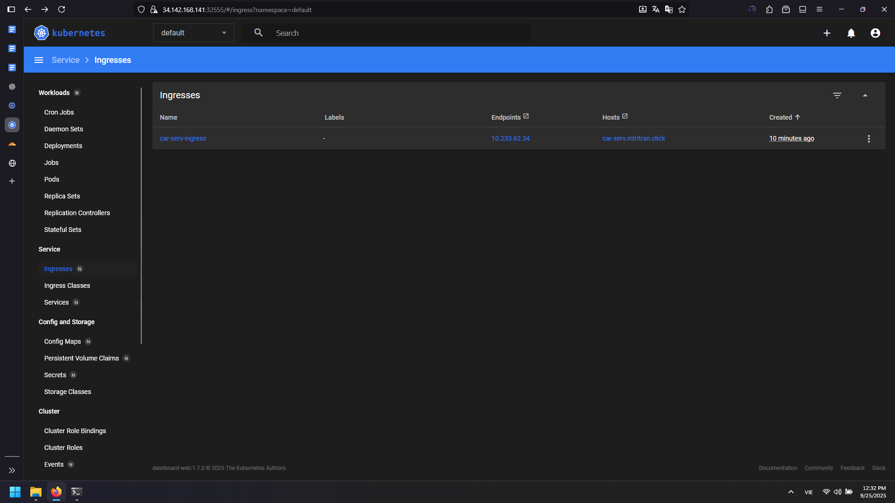
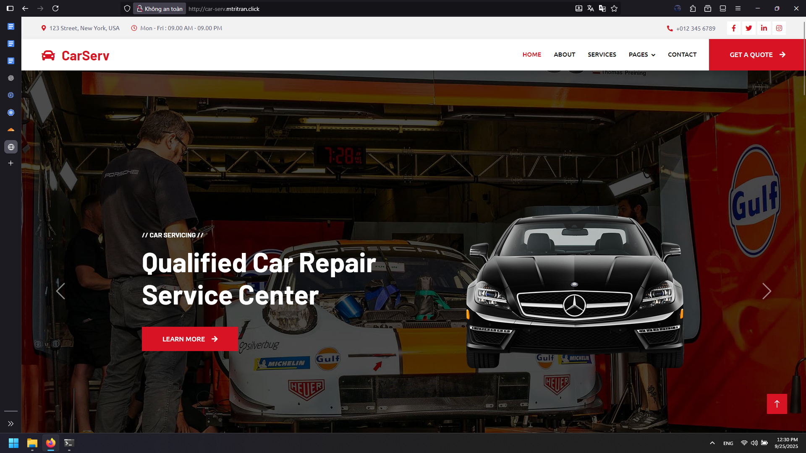

# Kubernetes Ingress and Application Deployment Guide

## Overview

This guide demonstrates how to install Ingress NGINX controller and deploy applications using proper Kubernetes workflows with Ingress, Services, and Deployments.

## 1. Install Ingress NGINX Controller

### Add Helm Repository

```bash
helm repo add ingress-nginx https://kubernetes.github.io/ingress-nginx
helm repo update
```

### Download and Extract Ingress NGINX

```bash
helm pull ingress-nginx/ingress-nginx
mv ingress-nginx-4.13.1.tgz kubespray/
cd kubespray/
tar -xzf ingress-nginx-4.13.1.tgz
```

### Configure Ingress NGINX

Edit the values file to use NodePort:

```bash
nano ingress-nginx/values.yaml
```

**Key Configuration Changes:**
1. **Service Type:** Change from `LoadBalancer` to `NodePort`
2. **NodePort Configuration:**
   - HTTP port: `31080`
   - HTTPS port: `31443`

Search for `service` section and modify:
```yaml
service:
  type: NodePort
  nodePorts:
    http: 31080
    https: 31443
```

### Deploy Ingress NGINX

```bash
# Create namespace
kubectl create ns ingress-nginx

# Install ingress controller
helm install ingress-nginx -f ingress-nginx/values.yaml -n ingress-nginx ingress-nginx
```

### Verify Installation

```bash
kubectl get all -n ingress-nginx
```

Expected output should show:
- Pod: `ingress-nginx-controller` in Running state
- Service: `ingress-nginx-controller` with NodePort type on ports 80:31080/TCP,443:31443/TCP
- Deployment: `ingress-nginx-controller` ready

Verify in Kubernetes Dashboard:
- Navigate to `ingress-nginx` namespace
- Check Services → Ingress Classes → Should show `nginx`

## 2. Create Load Balancer Server

### Infrastructure Setup

**Load Balancer Server:**
- **Name:** loadbalancer-k8s
- **Zone:** asia-southeast1 (Singapore)
- **Machine type:** e2-small (2 vCPU, 2 GB RAM)
- **Storage:** 15 GB disk
- **Purpose:** Distribute traffic across Kubernetes nodes

### Install and Configure NGINX

```bash
apt install -y nginx
apt update
apt install -y nano
```

### Configure Default Site

```bash
nano /etc/nginx/sites-available/default
```

Change the default port from `80` to `9999` to avoid conflicts.

### Create Load Balancer Configuration

```bash
nano /etc/nginx/conf.d/loadbalancer-k8s.conf
```

Add the following upstream configuration:

```nginx
upstream my_servers {
    server <k8s-master1-ip>:31080;
    server <k8s-master2-ip>:31080;
    server <k8s-master3-ip>:31080;
}

server {
    listen 80;
    location / {
        proxy_pass http://my_servers;
        proxy_redirect off;
        proxy_set_header Host $host;
        proxy_set_header X-Real-IP $remote_addr;
        proxy_set_header X-Forwarded-For $proxy_add_x_forwarded_for;
        proxy_set_header X-Forwarded-Proto $scheme;
    }
}
```

### Apply Configuration

```bash
systemctl restart nginx
```

### Configure Static IP

1. Go to VPC Network → IP addresses → External IP addresses
2. Convert loadbalancer-k8s IP from "Ephemeral" to "Static"
3. Note the static IP address for DNS configuration

## 3. Deploy Sample Application

### Create Deployment

In Kubernetes Dashboard, go to Deployments → Create:

```yaml
apiVersion: apps/v1
kind: Deployment
metadata:
  name: car-serv-deployment
spec:
  selector:
    matchLabels:
      app: car-serv
  replicas: 1
  template:
    metadata:
      labels:
        app: car-serv
    spec:
      containers:
      - name: car-serv
        image: elroydevops/car-serv
        ports:
        - containerPort: 80
```

Wait ~30 seconds for deployment to be ready.

### Create Service

Navigate to Services → Create:

```yaml
apiVersion: v1
kind: Service
metadata:
  name: car-serv-service
spec:
  selector:
    app: car-serv
  ports:
  - protocol: TCP
    port: 80
    targetPort: 80
```

Wait ~10 seconds for service to be created.

### Create Ingress

Navigate to Ingresses → Create:

```yaml
apiVersion: networking.k8s.io/v1
kind: Ingress
metadata:
  name: car-serv-ingress
spec:
  ingressClassName: nginx
  rules:
  - host: car-serv.mtritran.click
    http:
      paths:
      - pathType: Prefix
        path: /
        backend:
          service:
            name: car-serv-service
            port:
              number: 80
```

## 4. DNS Configuration

### Add Cloudflare DNS Record

1. Go to Cloudflare DNS management
2. Create new A record:
   - Name: `car-serv`
   - IPv4 address: Load Balancer static IP
   - Proxy status: DNS only (gray cloud)
3. Save the record



## 5. Test Application Access

### Verify Ingress Configuration

After creating the Ingress, the Dashboard should show the host information.



### Access Application

Open browser and navigate to: `http://car-serv.mtritran.click/`



If the application loads successfully, the complete workflow is working:
- DNS resolves to Load Balancer
- Load Balancer distributes traffic to Kubernetes nodes
- Ingress NGINX routes traffic to appropriate service
- Service forwards traffic to application pods

## 6. Architecture Flow

```
Internet → Cloudflare DNS → Load Balancer (NGINX) → Kubernetes Nodes (31080) → Ingress Controller → Service → Pods
```

### Traffic Flow Details

1. **DNS Resolution:** `car-serv.mtritran.click` resolves to Load Balancer IP
2. **Load Balancing:** NGINX distributes requests across 3 Kubernetes nodes
3. **Ingress Processing:** Ingress NGINX controller receives traffic on NodePort 31080
4. **Service Routing:** Ingress routes to `car-serv-service` based on host header
5. **Pod Delivery:** Service forwards traffic to `car-serv` pods

## 7. Key Benefits

### High Availability
- Load balancer distributes traffic across multiple nodes
- Kubernetes provides pod-level fault tolerance
- Ingress controller handles SSL termination and routing

### Scalability
- Easy horizontal scaling of application pods
- Load balancer can handle increased traffic
- Ingress supports multiple applications on same cluster

### Maintenance
- Rolling updates without downtime
- Health checks and automatic failover
- Centralized traffic management

## 8. Production Considerations

### Security
- Implement SSL/TLS certificates
- Configure network policies
- Use proper RBAC for cluster access

### Monitoring
- Monitor load balancer and Kubernetes metrics
- Implement logging for traffic analysis
- Set up alerting for service health

### Scalability
- Configure horizontal pod autoscaling
- Monitor resource usage and limits
- Plan for cluster capacity expansion

This setup provides a production-ready application deployment workflow with proper load balancing, ingress routing, and high availability across multiple Kubernetes nodes.