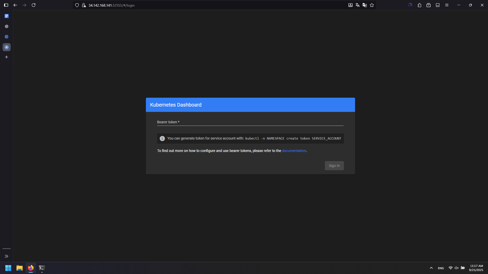
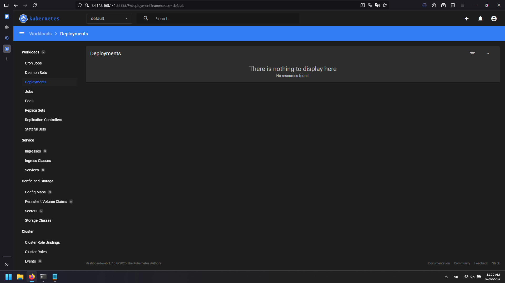
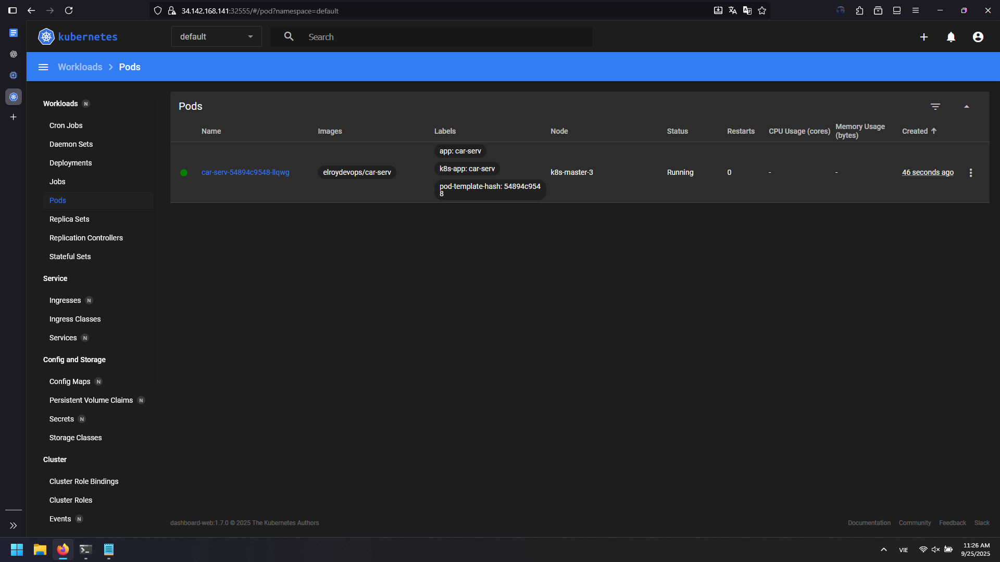
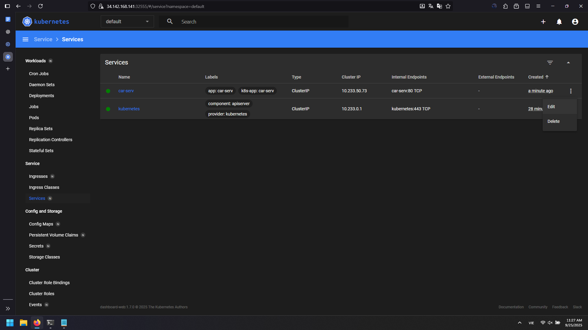
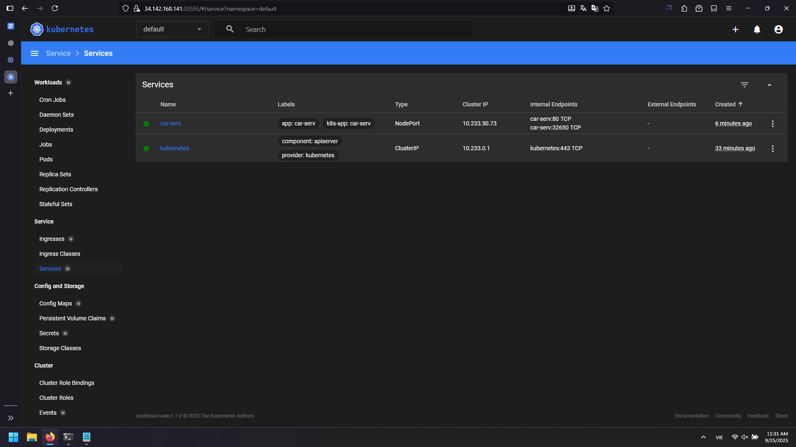
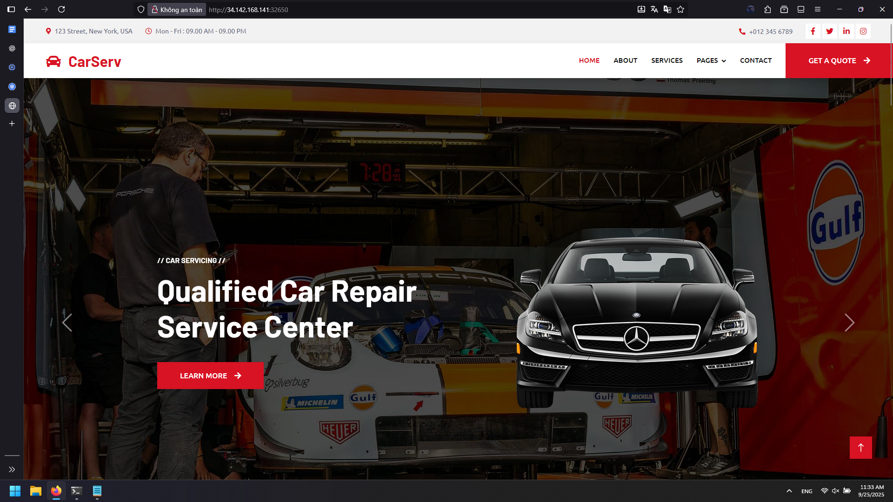

# Kubernetes Cluster and Dashboard Setup Guide

## Overview

This guide sets up a high-availability Kubernetes cluster using Kubespray and installs the Kubernetes Dashboard for web-based cluster management.

## 1. Infrastructure Setup

### Create Kubernetes Cluster VMs

**Cluster Specifications:**
- **Nodes:** k8s-master-1, k8s-master-2, k8s-master-3
- **Machine type:** e2-medium (2 vCPU, 4 GB RAM)
- **Storage:** 20 GB SSD each
- **Zone:** asia-southeast1 (Singapore)
- **Role:** Control plane nodes (masters also act as workers)

### Initial Server Configuration

Run on all three VMs:

```bash
# Add hosts entries
echo -e "<master1-ip> k8s-master-1\n<master2-ip> k8s-master-2\n<master3-ip> k8s-master-3" | sudo tee -a /etc/hosts

# Disable swap
swapoff -a
sed -i '/ swap / s/^\(.*\)$/#\1/g' /etc/fstab
```

## 2. SSH Key Configuration

### On k8s-master-1:

```bash
apt update -y && apt upgrade -y
apt install -y git python3 python3-pip

# Generate SSH key
ssh-keygen -t rsa -N "" -f ~/.ssh/id_rsa
cat ~/.ssh/id_rsa.pub
```

Copy the entire public key output.

### On k8s-master-2 and k8s-master-3:

```bash
mkdir -p ~/.ssh && chmod 700 ~/.ssh
echo "<public-key-from-master1>" >> ~/.ssh/authorized_keys
chmod 600 ~/.ssh/authorized_keys
```

### Back on k8s-master-1:

```bash
# Add key to own authorized_keys
cat ~/.ssh/id_rsa.pub >> ~/.ssh/authorized_keys
chmod 600 ~/.ssh/authorized_keys

# Test SSH connectivity
ssh root@<master2-ip>
ssh root@<master3-ip>
```

If both connections work without password prompts, SSH setup is complete.

## 3. Install Kubespray

### Ansible Installation

```bash
apt remove -y ansible ansible-core
pip3 install --upgrade pip
pip3 install ansible==9.4.0

# Add ansible to PATH
export PATH=$PATH:/usr/local/bin
echo 'export PATH=$PATH:/usr/local/bin' >> ~/.bashrc
source ~/.bashrc

# Verify installation
ansible --version  # Should be >= 2.15
```

### Download and Setup Kubespray

```bash
git clone https://github.com/kubernetes-sigs/kubespray.git --branch release-2.24
cd kubespray
pip3 install -r requirements.txt
```

### Create Inventory Configuration

```bash
cp -rfp inventory/sample inventory/mycluster
nano inventory/mycluster/hosts.ini
```

Add the following configuration:

```ini
[all]
k8s-master-1 ansible_host=<master1-ip> ip=<master1-ip>
k8s-master-2 ansible_host=<master2-ip> ip=<master2-ip>
k8s-master-3 ansible_host=<master3-ip> ip=<master3-ip>

[kube-master]
k8s-master-1
k8s-master-2
k8s-master-3

[kube-node]
k8s-master-1
k8s-master-2
k8s-master-3

[etcd]
k8s-master-1

[k8s-cluster:children]
kube-node
kube-master

[vault]
k8s-master-1
```

## 4. Deploy Kubernetes Cluster

### Run Kubespray Playbook

```bash
ansible-playbook -i inventory/mycluster/hosts.ini --become --become-user=root cluster.yml
```

**Note:** This process takes approximately 30 minutes to complete.

### Verify Cluster Installation

```bash
kubectl get nodes
```

Expected output:
```
NAME           STATUS   ROLES           AGE   VERSION
k8s-master-1   Ready    control-plane   10m   v1.28.10
k8s-master-2   Ready    control-plane   9m    v1.28.10
k8s-master-3   Ready    control-plane   9m    v1.28.10
```

## 5. Install Kubernetes Dashboard

### Install Helm

```bash
wget https://get.helm.sh/helm-v3.14.4-linux-amd64.tar.gz
tar -xvf helm-v3.14.4-linux-amd64.tar.gz
mv linux-amd64/helm /usr/bin/
helm version
```

### Deploy Kubernetes Dashboard

```bash
# Add dashboard repository
helm repo add kubernetes-dashboard https://kubernetes.github.io/dashboard/

# Install dashboard
helm upgrade --install kubernetes-dashboard kubernetes-dashboard/kubernetes-dashboard --create-namespace --namespace kubernetes-dashboard

# Wait for deployment
kubectl get all -n kubernetes-dashboard
```

Wait approximately 1 minute for all pods to be in "Running" state.

### Configure NodePort Access

```bash
# Export current values
helm show values kubernetes-dashboard/kubernetes-dashboard > values.yaml

# Edit values.yaml
nano values.yaml
```

Find the `kong` section and modify:
```yaml
kong:
  service:
    type: NodePort  # Change from ClusterIP
    enabled: true   # Change from false
```

### Apply Configuration Changes

```bash
helm upgrade kubernetes-dashboard kubernetes-dashboard/kubernetes-dashboard -f values.yaml -n kubernetes-dashboard

# Check service configuration
kubectl get all -n kubernetes-dashboard
```

Note the NodePort assigned (typically in range 30000-32767).

### Configure Firewall

Create firewall rule in GCP Console for the NodePort (e.g., port 32555).

## 6. Create Dashboard Admin User

### Create Admin Service Account

```bash
nano admin-user-k8s.yaml
```

Add the following configuration:

```yaml
apiVersion: v1
kind: ServiceAccount
metadata:
  name: admin-user
  namespace: kubernetes-dashboard
---
apiVersion: rbac.authorization.k8s.io/v1
kind: ClusterRoleBinding
metadata:
  name: admin-user
roleRef:
  apiGroup: rbac.authorization.k8s.io
  kind: ClusterRole
  name: cluster-admin
subjects:
- kind: ServiceAccount
  name: admin-user
  namespace: kubernetes-dashboard
---
apiVersion: v1
kind: Secret
metadata:
  name: admin-user
  namespace: kubernetes-dashboard
  annotations:
    kubernetes.io/service-account.name: "admin-user"
type: kubernetes.io/service-account-token
```

### Apply Configuration and Get Token

```bash
kubectl apply -f admin-user-k8s.yaml

# Verify secret creation
kubectl get secret -n kubernetes-dashboard

# Extract bearer token
kubectl get secret admin-user -n kubernetes-dashboard -o jsonpath={".data.token"} | base64 -d
```

Copy the token output.

## 7. Access Kubernetes Dashboard

### Web Access

1. Open browser and navigate to: `https://<master1-public-ip>:<nodeport>/`
2. Select "Token" authentication method
3. Paste the bearer token from previous step



4. Click "Sign In"

## 8. Test Application Deployment

### Deploy Sample Application

1. **In Dashboard:** Deployments → (+) Create new resource → Create from form



2. **Configuration:**
   - App name: `car-serv`
   - Container image: `elroydevops/car-serv`
   - Number of pods: `1`
   - Service: `Internal`
   - Port: `80`
   - Target port: `80`
   - Protocol: `TCP`
   - Namespace: `default`
   - Labels: Key: `app`, Value: `car-serv`

3. Click "Deploy" and wait ~40 seconds for pod to start



### Expose Service via NodePort

1. **Navigate to:** Services → car-serv → Edit



2. **Modify service configuration:**
   - Change `type: ClusterIP` to `type: NodePort`
   - Remove unnecessary metadata fields
   - Keep essential configuration



3. **Final service configuration:**
```yaml
apiVersion: v1
kind: Service
metadata:
  labels:
    app: car-serv
    k8s-app: car-serv
  name: car-serv
  namespace: default
spec:
  ipFamilies:
    - IPv4
  ipFamilyPolicy: SingleStack
  ports:
    - name: tcp-80-80-2zktj
      port: 80
      protocol: TCP
      targetPort: 80
  selector:
    app: car-serv
    k8s-app: car-serv
  sessionAffinity: None
  type: NodePort
```

4. Click "Update"

### Access Application

1. Note the assigned NodePort (e.g., 32650)
2. Create firewall rule for the NodePort
3. Access application: `http://<master1-public-ip>:<nodeport>`



## 9. Cluster Features

### High Availability Setup
- 3 control plane nodes for fault tolerance
- etcd cluster for data persistence
- Load balancing across masters

### Dashboard Capabilities
- Visual cluster resource management
- Real-time monitoring and logging
- Application deployment and scaling
- RBAC and security management

### Network Configuration
- Pod networking via CNI
- Service discovery and load balancing
- Ingress controller support
- NetworkPolicy enforcement

## 10. Best Practices

### Security
- Use RBAC for fine-grained access control
- Regularly update cluster components
- Monitor cluster security events
- Implement Pod Security Standards

### Operations
- Regular etcd backups
- Monitor cluster resource usage
- Implement logging and monitoring stack
- Plan for cluster upgrades and maintenance

This setup provides a production-ready Kubernetes cluster with web-based management interface, suitable for containerized application deployment and orchestration.