# Portus Container Registry Setup

## Overview

This guide sets up Portus as a private Docker registry with web UI for container image management, integrated with SSL certificates and team-based access control.

## 1. Infrastructure Setup

### Create Portus Server

**Portus Server:**
- **Machine type:** e2-small (2 vCPU, 2 GB RAM)
- **Storage:** 20 GB SSD
- **Zone:** asia-east2 (Hong Kong)
- **Purpose:** Host Portus registry and web interface

### Configure Static IP and DNS

1. **Convert Portus server IP to static:**
   - Go to VPC Network > IP addresses > External IP addresses
   - Change Portus server IP from "Ephemeral" to "Static"

2. **Add DNS record in Cloudflare:**
   - Name: `portus`
   - IPv4 address: Portus server static IP
   - Proxy status: DNS only (gray cloud)

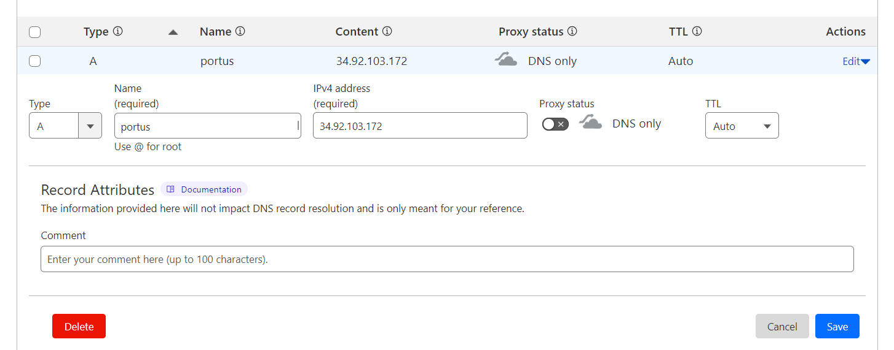

## 2. Install Prerequisites

SSH into the Portus server and install required packages:

```bash
apt update -y
apt install -y docker.io docker-compose certbot net-tools
```

## 3. Setup Portus

### Download Portus

```bash
mkdir -p /tools/portus
cd /tools/portus/
git clone https://github.com/SUSE/Portus.git
```

### Extract Docker Compose Configuration

```bash
mv Portus/examples/compose/ .
rm -rf Portus/
cd compose/
```

## 4. Configure SSL Certificates

### Generate SSL Certificate

```bash
sudo certbot certonly --standalone -d portus.mtritran.click --preferred-challenges http --agree-tos -m <your-email@example.com> --keep-until-expiring
```

### Configure Nginx

Edit the Nginx configuration:
```bash
nano nginx/nginx.conf
```

Find the line with `ssl on;` and comment it out:
```nginx
# ssl on;
```

Note the paths for SSL certificate and key files.

### Copy SSL Certificates

```bash
cp /etc/letsencrypt/live/portus.mtritran.click/fullchain.pem secrets/portus.crt
cp /etc/letsencrypt/live/portus.mtritran.click/privkey.pem secrets/portus.key
```

Verify certificates are in place:
```bash
ls secrets/
# Should show: portus.crt portus.key
```

## 5. Configure Portus Environment

### Update Environment Configuration

```bash
nano .env
```

Change the IP address to domain name:
```env
PORTUS_MACHINE_FQDN_VALUE=portus.mtritran.click
```

### Update Docker Images

Update MariaDB and Registry versions:
```bash
sed -i 's/mariadb:10\.0\.23/mariadb:10.6/g' docker-compose.yml
sed -i 's/registry:2\.6/registry:2.8/g' docker-compose.yml
```

Verify image versions:
```bash
grep -n 'image:' docker-compose.yml
```

Expected output:
```
5: image: opensuse/portus:head
37: image: opensuse/portus:head
65: image: library/mariadb:10.6
76: image: library/registry:2.8
108: image: library/nginx:alpine
```

## 6. Deploy Portus

### Pull and Start Services

```bash
docker-compose -f docker-compose.yml pull
docker-compose -f docker-compose.yml up -d
```

### Verify Deployment

```bash
docker ps -a
```

Expected containers:
- `compose_nginx_1` (ports 80, 443)
- `compose_registry_1` (ports 5000-5001)
- `compose_background_1`
- `compose_portus_1` (port 3000)
- `compose_db_1` (MariaDB)

### Set Auto-restart

```bash
docker update --restart=always $(docker ps -q)
```

## 7. Initial Portus Configuration

### Access Web Interface

Open https://portus.mtritran.click in your browser.

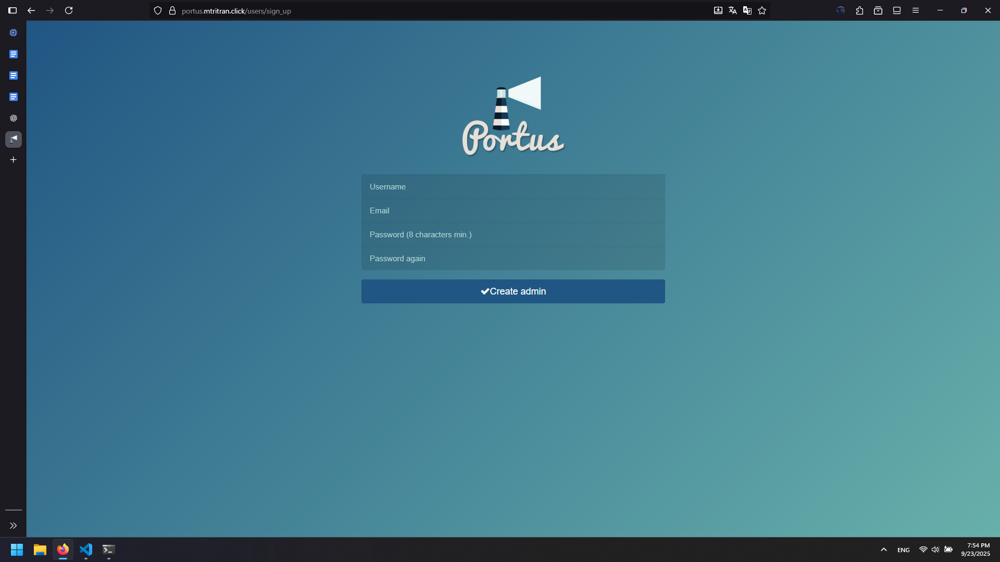

### Create Admin Account

1. Register first user account:
   - Username: `<your-username>`
   - Password: `<secure-password>`
   - Email: `<your-email>`

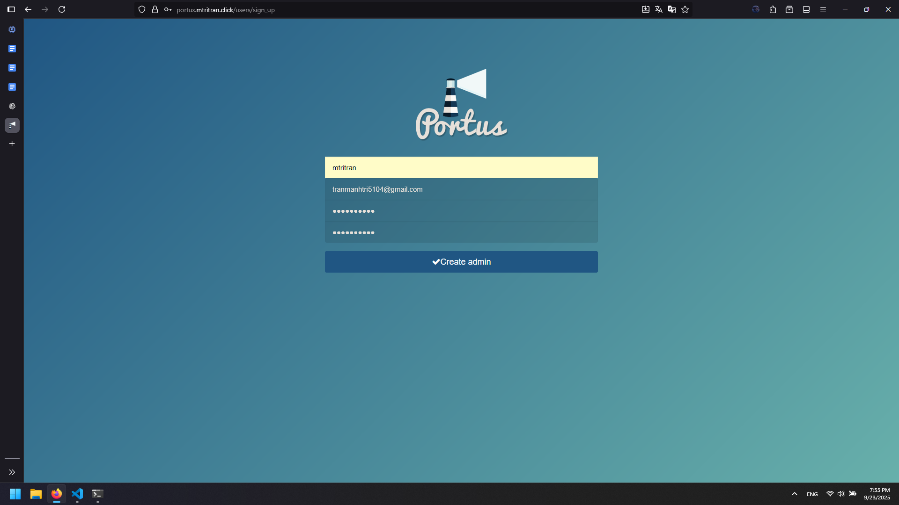

### Configure Registry

1. Set registry name: `registry-devsecops`
2. Set hostname: `portus.mtritran.click`
3. Check "Use SSL"
4. Click "Save"

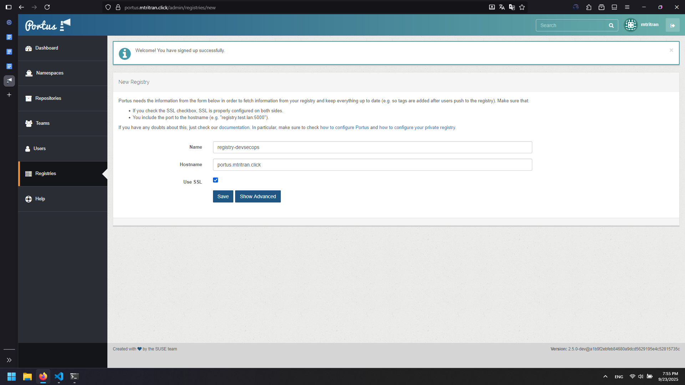

### Create Team

1. Go to Teams → Create Team
2. Team name: `onlineshop-team`
3. Click "Save"

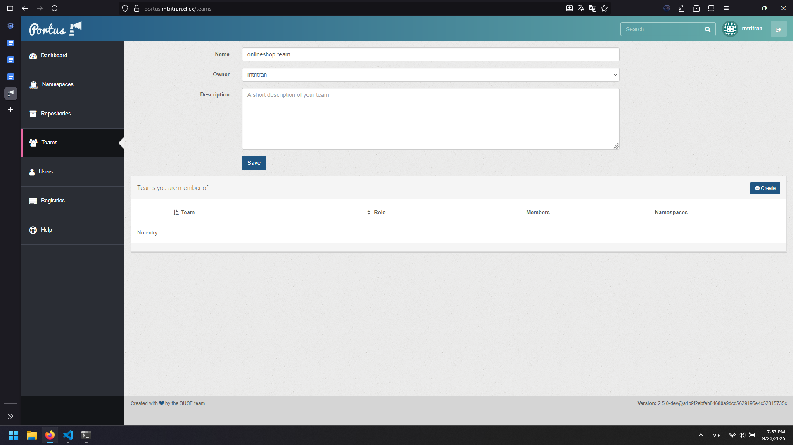

## 8. Test Registry Functionality

### Create Namespace

1. In Portus web interface, click on `onlineshop-team`

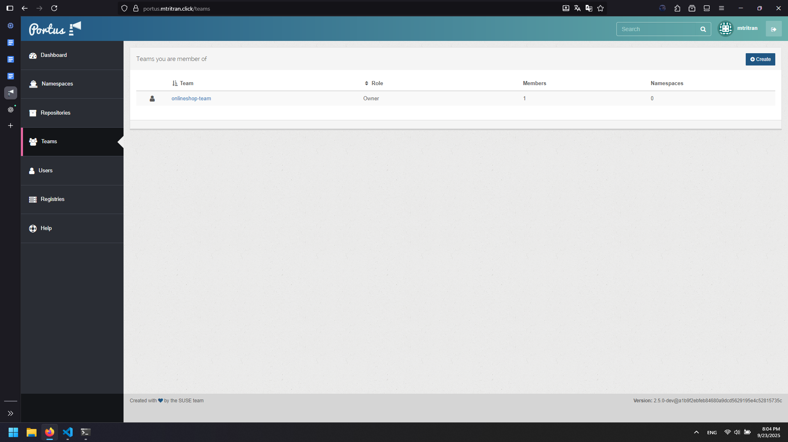

2. Go to Namespaces → Create

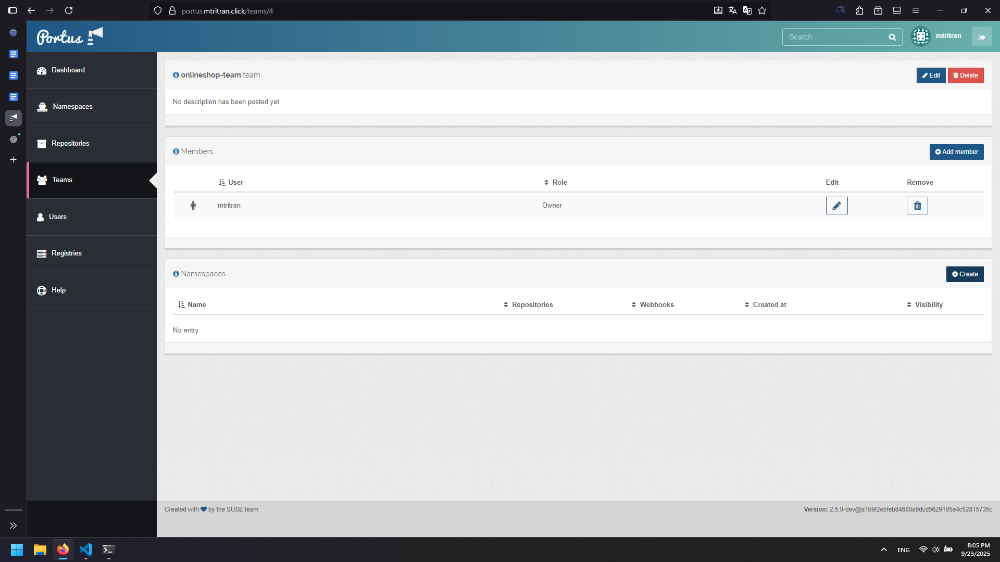

3. Namespace name: `onlineshop`

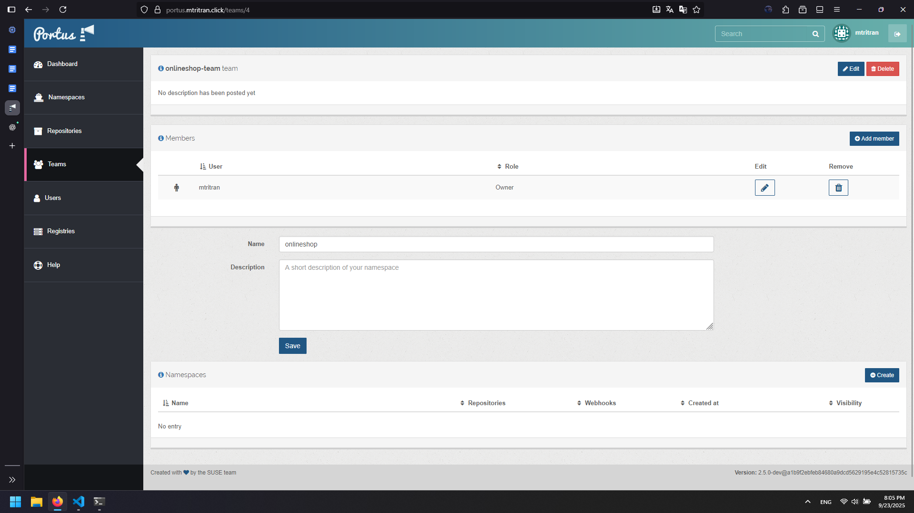

4. Click "Create"

### Test Image Push

From deployment server (assuming you have built images):

```bash
# Tag existing image
docker tag online-shop-frontend:latest portus.mtritran.click/onlineshop/online-shop-frontend:latest

# Login to registry
docker login portus.mtritran.click -u <your-username> -p <your-password>

# Push image
docker push portus.mtritran.click/onlineshop/online-shop-frontend:latest
```

### Verify Push

1. In Portus web interface, navigate to namespace `onlineshop`

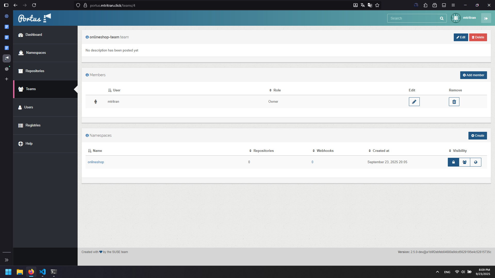

2. Click on repository `online-shop-frontend`

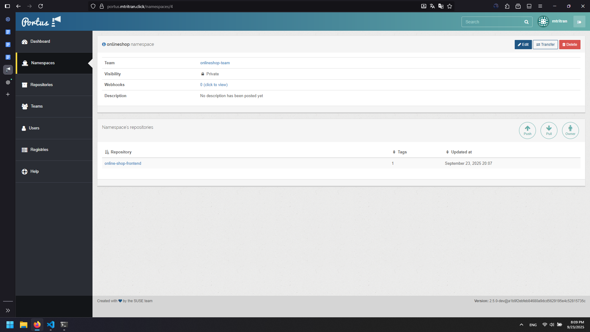

3. Verify the `latest` tag is present

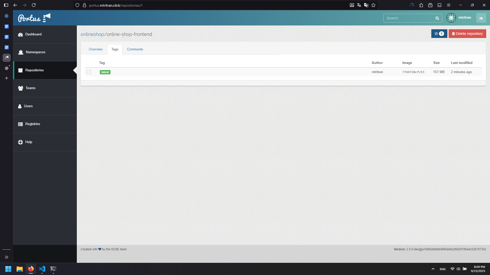

## 9. Test Image Pull

### Remove Local Image

```bash
# Stop and remove container
docker rm -f <container-id>

# Remove images
docker rmi online-shop-frontend:latest
docker rmi <image-id>
```

### Pull from Registry

```bash
# Pull image from Portus
docker pull portus.mtritran.click/onlineshop/online-shop-frontend:latest

# Run container
docker run -d \
  --name online-shop-frontend \
  -p 3000:3000 \
  portus.mtritran.click/onlineshop/online-shop-frontend:latest
```

### Verify Deployment

```bash
docker ps -a
```

Access the application at `http://<deploy-server-public-ip>:3000` to verify it's working.

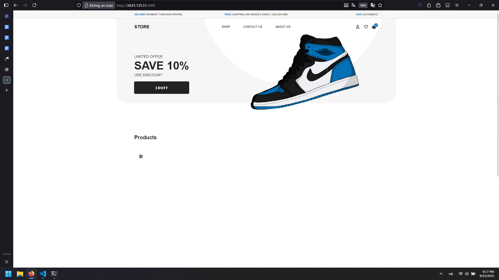

## 10. Registry Management Features

### Web Interface Features

- **Dashboard**: Overview of registries, repositories, and users
- **Repositories**: Browse and manage container images
- **Teams**: Organize users and control access
- **Namespaces**: Logical grouping of repositories
- **Tags**: Version management for images
- **Security**: Vulnerability scanning (if enabled)

### Command Line Usage

**Login:**
```bash
docker login portus.mtritran.click
```

**Tag and Push:**
```bash
docker tag <local-image> portus.mtritran.click/<namespace>/<repository>:<tag>
docker push portus.mtritran.click/<namespace>/<repository>:<tag>
```

**Pull:**
```bash
docker pull portus.mtritran.click/<namespace>/<repository>:<tag>
```

## Architecture Overview

The deployed Portus setup consists of:

- **Nginx**: SSL termination and reverse proxy
- **Portus Web UI**: Registry management interface
- **Portus Background**: Background job processing
- **Docker Registry**: Actual image storage
- **MariaDB**: Portus metadata and user management

All components communicate through Docker networking with SSL-secured external access via the domain name.