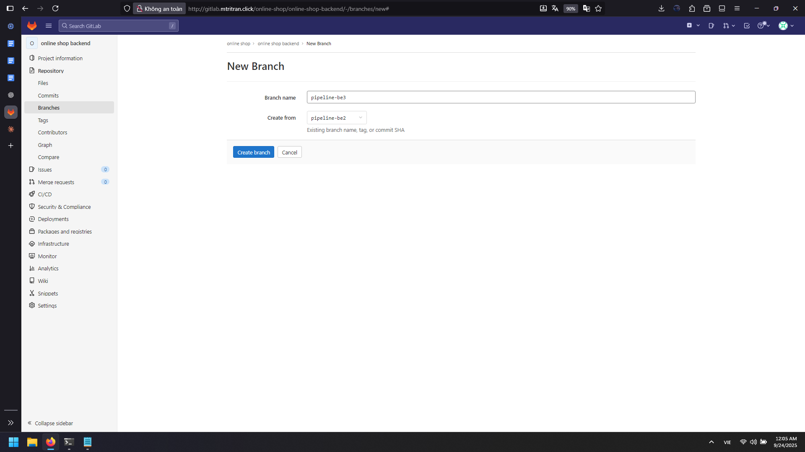
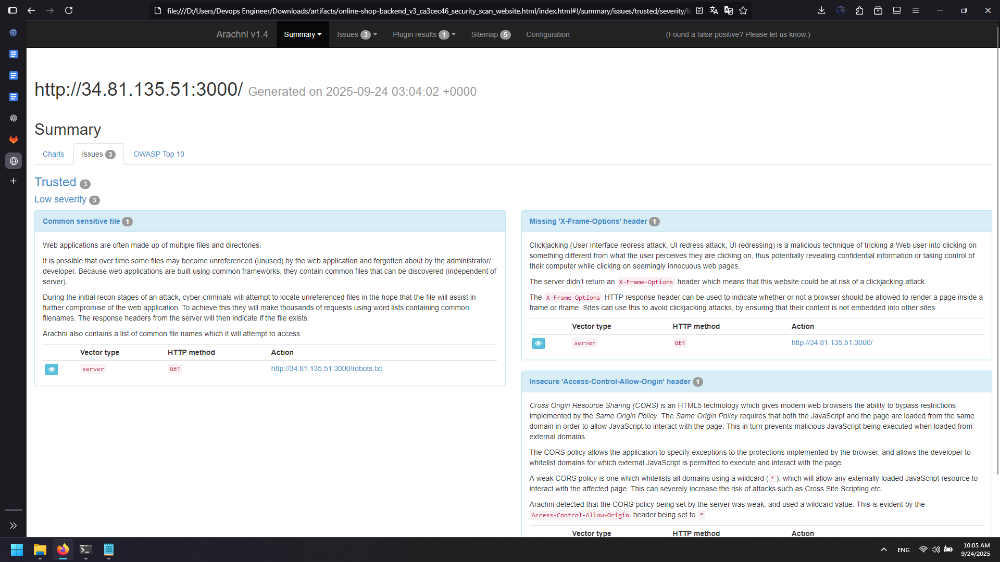
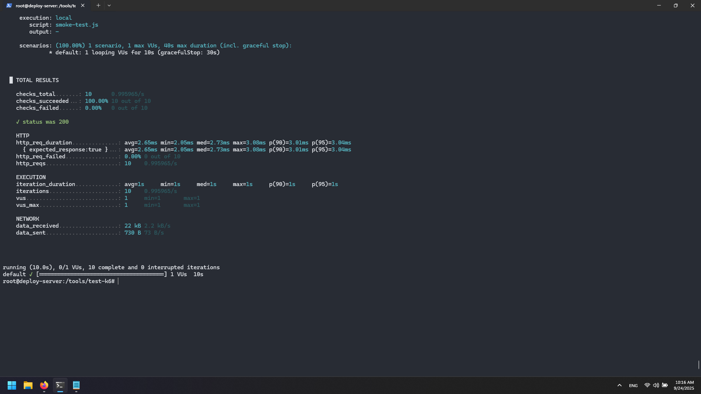
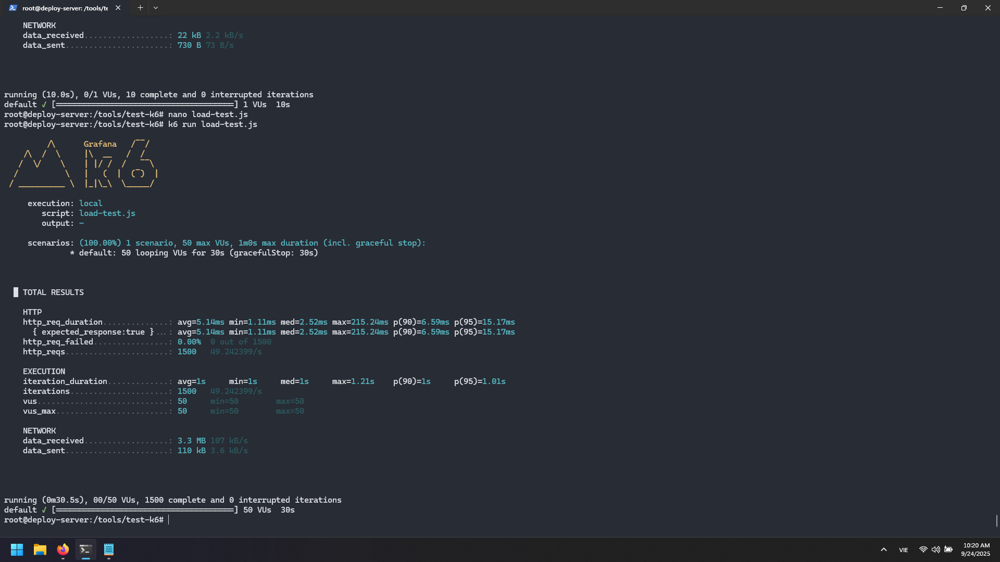
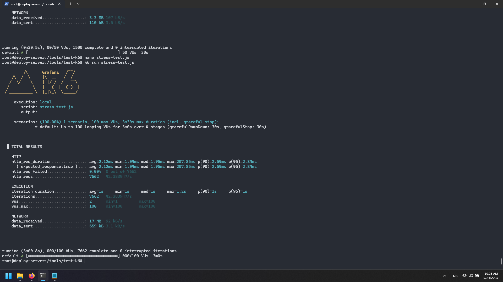
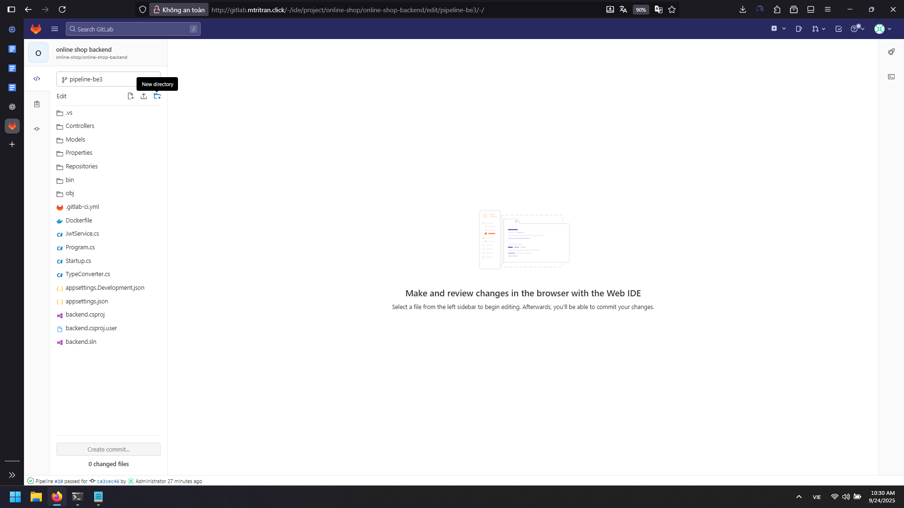
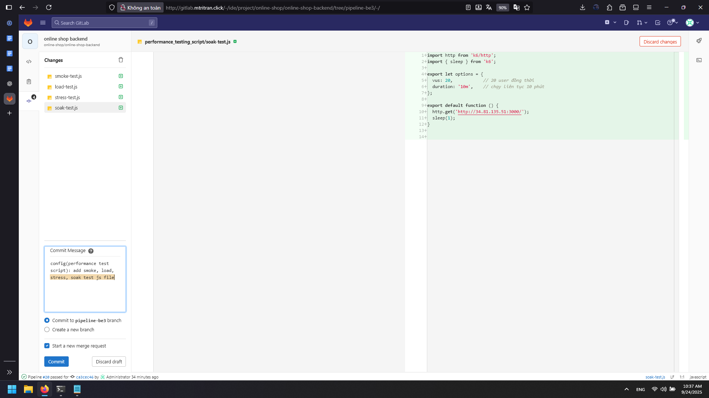
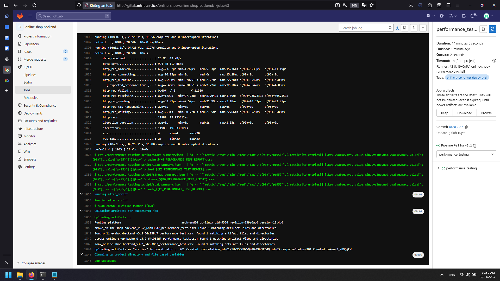

# Runtime Security and Performance Testing Guide

## Overview

This guide implements comprehensive runtime testing including security scanning with Arachni and performance testing with k6, integrated into GitLab CI/CD pipelines for automated quality assurance.

## 1. Runtime Security Testing with Arachni

### Manual Arachni Setup

Install Arachni web application security scanner:

```bash
wget https://github.com/Arachni/arachni/releases/download/v1.4/arachni-1.4-0.5.10-linux-x86_64.tar.gz
tar -xvf arachni-1.4-0.5.10-linux-x86_64.tar.gz
cd arachni-1.4-0.5.10
```

### Run Security Scan

Execute comprehensive security scan:

```bash
bin/arachni \
  --output-verbose \
  --scope-include-subdomains \
  --scope-page-limit=3 \
  --scope-auto-redundant=1 \
  --checks=xss,sql_injection,file_inclusion \
  --http-request-concurrency=3 \
  --audit-links --audit-forms \
  --timeout=120 \
  http://<target-url>:3000 \
  --report-save-path=/tmp/online-shop-frontend.afr
```

### Generate HTML Report

Convert scan results to HTML format:

```bash
bin/arachni_reporter /tmp/online-shop-frontend.afr \
  --reporter=html:outfile=/tmp/online-shop-frontend.html.zip
```

Verify report generation:
```bash
ls /tmp/
# Should show: online-shop-frontend.html.zip
```

### Security Scan Pipeline

1. Create new branch `pipeline-be3` from `pipeline-be2`

  

2. Add file `.gitlab-ci.yml` with the following content:

```yaml
variables:
  ARACHNI_WEBSITE_REPORT: "${CI_PROJECT_NAME}_${CI_COMMIT_REF_NAME}_${CI_COMMIT_SHORT_SHA}_security_scan_website"

stages:
  - security_scan_website

security_scan_website:
  stage: security_scan_website
  variables:
    GIT_STRATEGY: none
  script:
    - docker run --rm -v /tmp:/tmp --network host devopseduvn/arachni:v1.4-0.5.10 bin/arachni --output-verbose --scope-include-subdomains $ADDRESS_FRONTEND --report-save-path=/tmp/$ARACHNI_WEBSITE_REPORT.afr
    - docker run --rm -v /tmp:/tmp devopseduvn/arachni:v1.4-0.5.10 bin/arachni_reporter /tmp/$ARACHNI_WEBSITE_REPORT.afr --reporter=html:outfile=/tmp/$ARACHNI_WEBSITE_REPORT.html.zip
    - sudo chmod 666 /tmp/$ARACHNI_WEBSITE_REPORT.html.zip
    - cp /tmp/$ARACHNI_WEBSITE_REPORT.html.zip .
  tags:
    - online-shop-runner-deploy-shell
  only:
    - tags
  artifacts:
    paths:
      - $ARACHNI_WEBSITE_REPORT.html.zip
    expire_in: 7 days
```

3. Add environment variable:
- `ADDRESS_FRONTEND`: `http://<target-server-ip>:3000/`

4. Create tag to trigger pipeline and download artifact after job passed to see report:
  

## 2. Performance Testing with k6

### k6 Installation

Install k6 performance testing tool:

```bash
sudo gpg -k
sudo gpg --no-default-keyring --keyring /usr/share/keyrings/k6-archive-keyring.gpg --keyserver hkp://keyserver.ubuntu.com:80 --recv-keys C5AD17C747E3415A3642D57D77C6C491D6AC1D69
echo "deb [signed-by=/usr/share/keyrings/k6-archive-keyring.gpg] https://dl.k6.io/deb stable main" | sudo tee /etc/apt/sources.list.d/k6.list
sudo apt-get update
sudo apt-get install k6
```

### Performance Test Scripts

Create test directory:
```bash
mkdir -p /tools/test-k6 && cd /tools/test-k6
```

#### Smoke Test (Basic Health Check)

**smoke-test.js:**
```javascript
import http from 'k6/http';
import { check, sleep } from 'k6';

export let options = {
  vus: 1, // 1 user
  duration: '10s', // run for 10 seconds
};

export default function () {
  let res = http.get('http://<target-server-ip>:3000/');
  check(res, { 'status was 200': (r) => r.status === 200 });
  sleep(1);
}
```
  

**Expected Results:**
- All requests return 200 OK (100% passed)
- Response time: 2-3ms per request
- Confirms system is alive and responsive

- File smoke-test here: [performance_testing_script/smoke-test.js](performance_testing_script/smoke-test.js)

#### Load Test (Normal Traffic Simulation)

**load-test.js:**
```javascript
import http from 'k6/http';
import { sleep } from 'k6';

export let options = {
  vus: 50, // 50 concurrent users
  duration: '30s', // for 30 seconds
};

export default function () {
  http.get('http://<target-server-ip>:3000/');
  sleep(1);
}
```
  

**Expected Results:**
- 1500 requests in 30 seconds with 50 VUs
- 0% failed requests
- Average response time: ~5ms, p95: ~15ms
- System stable under normal load

- File load-test here: [performance_testing_script/load-test.js](performance_testing_script/load-test.js)

#### Stress Test (Find Breaking Point)

**stress-test.js:**
```javascript
import http from 'k6/http';
import { sleep } from 'k6';

export let options = {
  stages: [
    { duration: '30s', target: 20 }, // warm up: 20 users
    { duration: '1m', target: 50 }, // ramp to 50 users
    { duration: '30s', target: 100 }, // peak: 100 users
    { duration: '1m', target: 0 }, // ramp down to 0
  ],
};

export default function () {
  http.get('http://<target-server-ip>:3000/');
  sleep(1);
}
```
  

**Expected Results:**
- 7662 requests in 3 minutes with 100 VUs
- 0% failed requests
- Average response time: ~2.1ms, p95: ~2.8ms
- System stable even under stress conditions

- File stress-test here: [performance_testing_script/stress-test.js](performance_testing_script/stress-test.js)

#### Soak Test (Long-term Stability)

**soak-test.js:**
```javascript
import http from 'k6/http';
import { sleep } from 'k6';

export let options = {
  vus: 20, // 20 concurrent users
  duration: '10m', // run continuously for 10 minutes
};

export default function () {
  http.get('http://<target-server-ip>:3000/');
  sleep(1);
}
```

**Purpose:** Verify system stability over extended periods, detect memory leaks and performance degradation.

- File soak-test here: [performance_testing_script/soak-test.js](performance_testing_script/soak-test.js)

### Manual Test Execution

Run each test type:

```bash
# Smoke test
k6 run smoke-test.js

# Load test  
k6 run load-test.js

# Stress test
k6 run stress-test.js

# Soak test
k6 run soak-test.js
```

## 3. Performance Testing Pipeline

### Create Test Scripts in Repository

**Create Directory Structure:**
   - Repository → New directory: `performance_testing_script`

  

   - Add all four test files to this directory

  

### Performance Testing Pipeline Configuration

```yaml
variables:
  K6_PERFORMANCE_TEST_REPORT: "${CI_PROJECT_NAME}_${CI_COMMIT_REF_NAME}_${CI_COMMIT_SHORT_SHA}_performance_test"

stages:
  - performance_testing

performance_testing:
  stage: performance_testing
  variables:
    GIT_STRATEGY: clone
  script:
    - chmod -R 777 ./performance_testing_script/
    
    # 1. Smoke test
    - docker run --rm -v $(pwd)/performance_testing_script:/performance_testing_script loadimpact/k6 run --summary-export=/performance_testing_script/smoke_summary.json /performance_testing_script/smoke-test.js
    
    # 2. Load test
    - docker run --rm -v $(pwd)/performance_testing_script:/performance_testing_script loadimpact/k6 run --summary-export=/performance_testing_script/load_summary.json /performance_testing_script/load-test.js
    
    # 3. Stress test
    - docker run --rm -v $(pwd)/performance_testing_script:/performance_testing_script loadimpact/k6 run --summary-export=/performance_testing_script/stress_summary.json /performance_testing_script/stress-test.js
    
    # 4. Soak test
    - docker run --rm -v $(pwd)/performance_testing_script:/performance_testing_script loadimpact/k6 run --summary-export=/performance_testing_script/soak_summary.json /performance_testing_script/soak-test.js
    
    # Convert JSON summaries to CSV format
    - cat ./performance_testing_script/smoke_summary.json | jq -r '["metric","avg","min","med","max","p(90)","p(95)"],(.metrics|to_entries[]|[.key,.value.avg,.value.min,.value.med,.value.max,.value["p(90)"],.value["p(95)"]])|@csv' > smoke_${K6_PERFORMANCE_TEST_REPORT}.csv
    
    - cat ./performance_testing_script/load_summary.json | jq -r '["metric","avg","min","med","max","p(90)","p(95)"],(.metrics|to_entries[]|[.key,.value.avg,.value.min,.value.med,.value.max,.value["p(90)"],.value["p(95)"]])|@csv' > load_${K6_PERFORMANCE_TEST_REPORT}.csv
    
    - cat ./performance_testing_script/stress_summary.json | jq -r '["metric","avg","min","med","max","p(90)","p(95)"],(.metrics|to_entries[]|[.key,.value.avg,.value.min,.value.med,.value.max,.value["p(90)"],.value["p(95)"]])|@csv' > stress_${K6_PERFORMANCE_TEST_REPORT}.csv
    
    - cat ./performance_testing_script/soak_summary.json | jq -r '["metric","avg","min","med","max","p(90)","p(95)"],(.metrics|to_entries[]|[.key,.value.avg,.value.min,.value.med,.value.max,.value["p(90)"],.value["p(95)"]])|@csv' > soak_${K6_PERFORMANCE_TEST_REPORT}.csv
    
  after_script:
    - sudo chown -R gitlab-runner $(pwd)
  tags:
    - online-shop-runner-deploy-shell
  only:
    - tags
  artifacts:
    paths:
      - smoke_${K6_PERFORMANCE_TEST_REPORT}.csv
      - load_${K6_PERFORMANCE_TEST_REPORT}.csv
      - stress_${K6_PERFORMANCE_TEST_REPORT}.csv
      - soak_${K6_PERFORMANCE_TEST_REPORT}.csv
    expire_in: 1 day
```
- File pipeline here: [pipeline/runtime-performance-testing.yml](pipeline/runtime-performance-testing.yml)
- Artifacts here: [artifacts/artifactsofruntimeandperform/](artifacts/artifactsofruntimeandperform/)

  

## 4. Testing Strategy Overview

### Security Testing (Arachni)
- **Scope:** Web application vulnerabilities
- **Checks:** XSS, SQL injection, file inclusion
- **Output:** Comprehensive HTML security report
- **Frequency:** On every release tag

### Performance Testing (k6)
- **Test Types:**
  - **Smoke:** Basic functionality verification
  - **Load:** Normal traffic simulation
  - **Stress:** Breaking point identification  
  - **Soak:** Long-term stability validation
- **Output:** CSV performance metrics
- **Frequency:** On every release tag

## 5. Report Analysis

### Security Report Contents
- Vulnerability severity ratings
- Affected endpoints and parameters
- Remediation recommendations
- Compliance assessment

### Performance Report Metrics
- **Response Times:** avg, min, median, max, p(90), p(95)
- **Throughput:** requests per second
- **Error Rates:** failed request percentages
- **Resource Utilization:** system performance under load

## 6. Best Practices

### Security Testing
- Run scans against staging environments
- Review reports before production deployment
- Track vulnerability trends over time
- Integrate with security management systems

### Performance Testing
- Establish baseline performance metrics
- Set performance budgets and SLAs
- Monitor trends across releases
- Test realistic user scenarios

### Pipeline Integration
- Fail builds on critical security issues
- Set performance thresholds for acceptance
- Archive reports for compliance
- Notify teams of test results

This comprehensive testing approach ensures both security and performance quality gates are integrated into the CI/CD pipeline, providing automated feedback on application readiness for production deployment.