# Source Code Security Scanning with GitLab CI/CD

## Overview

This guide implements automated security scanning in GitLab CI/CD pipelines using three industry-standard tools: CodeClimate, Snyk, and Trivy. The setup demonstrates DevSecOps practices by integrating security scanning into the development workflow.

## 1. Manual Security Scanning Test

### Prerequisites

SSH into your deployment server where source code is available:

```bash
sudo -i
su <project-user>
cd ~/projects/backend/
```

### CodeClimate Analysis

CodeClimate provides code quality and maintainability analysis:

```bash
docker run --rm -it \
  -e CODECLIMATE_CODE="$PWD" \
  -v "$PWD":/code \
  -v /var/run/docker.sock:/var/run/docker.sock \
  -v /tmp/cc:/tmp/cc \
  codeclimate/codeclimate analyze -f html > codeclimate-report.html
```

### Snyk Security Scanning

Snyk identifies vulnerabilities in dependencies and code:

1. **Get Snyk Token:**
   - Visit https://snyk.io
   - Login to your account
   - Go to Account Settings → Auth Token

  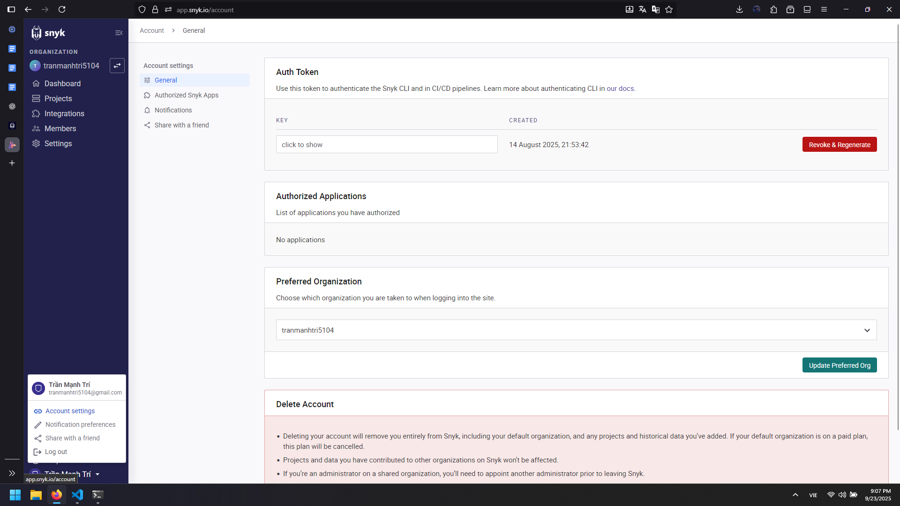

   - Copy the token

2. **Run Snyk Scan:**
```bash
export SNYK_TOKEN="<your-snyk-token>"

docker run --rm -it \
  -v "$PWD":/app \
  -w /app \
  -e SNYK_TOKEN="$SNYK_TOKEN" \
  node:18-alpine \
  sh -c "
    apk add --no-cache git && \
    npm install -g snyk snyk-to-html && \
    snyk auth \$SNYK_TOKEN && \
    if [ -f package.json ]; then npm install; fi && \
    snyk test --json > /tmp/snyk.json || true && \
    snyk-to-html -i /tmp/snyk.json -o snyk-report.html
  "
```

### Trivy Filesystem Scan

Trivy scans for security vulnerabilities in filesystem:

```bash
docker run --rm -it \
  -v "$PWD":/project \
  aquasec/trivy fs /project \
  --severity HIGH,CRITICAL \
  --format template \
  --template "@contrib/html.tpl" \
  --output /project/trivyfs-report.html
```

## 2. Build Server Setup

### Install Docker on Build Server

SSH into your build server and install Docker:

```bash
sudo apt update -y
sudo apt install -y docker.io docker-compose
sudo systemctl enable docker
sudo systemctl start docker
docker --version
```

### Configure GitLab Runner Docker Access

Grant Docker permissions to gitlab-runner user:

```bash
sudo usermod -aG docker gitlab-runner
sudo systemctl restart gitlab-runner
```

### Verify Docker Access

Test Docker access for gitlab-runner:
```bash
sudo -u gitlab-runner -H docker ps
```

If no errors appear, the user has proper Docker access.

## 3. GitLab Project Configuration

### Branch Management Setup

1. **Create Development Branch:**
   - In GitLab project → Repository → Branches

  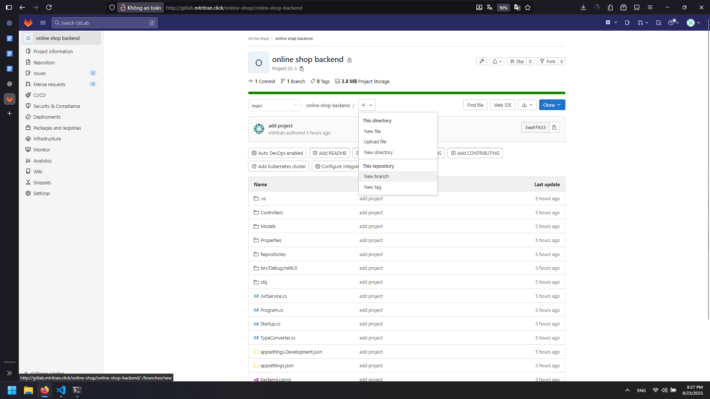

   - Create new branch: `develop` from `main`

  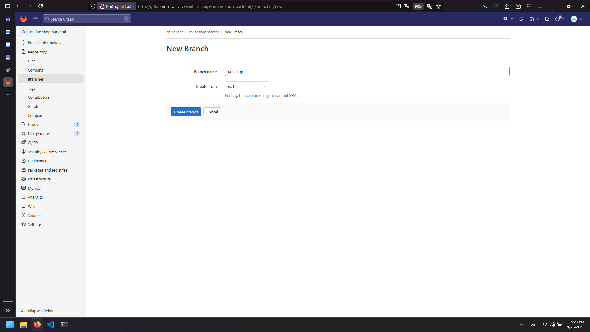 

2. **Set Default Branch:**
   - Settings → Repository → Default branch

  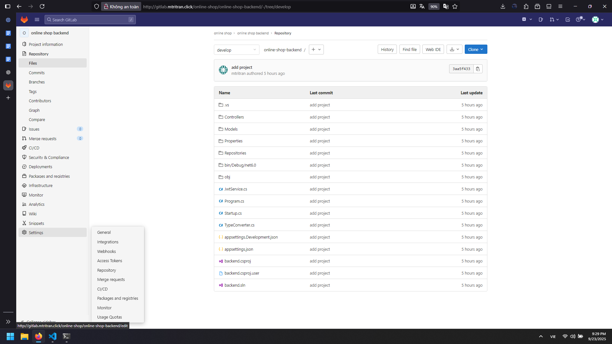

   - Change from `main` to `develop`

  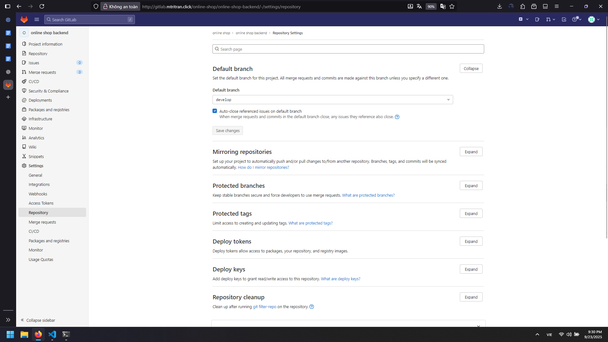

   - Save changes

3. **Configure Protected Branches:**
   - Settings → Repository → Protected branches
   - For `main` branch: Set "Allowed to push" to "No one"

  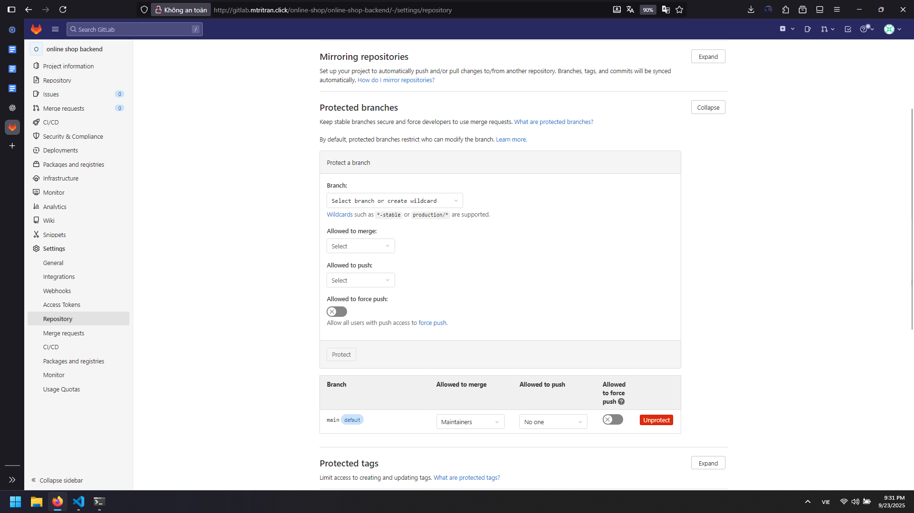

   - This enforces merge request workflow

### Environment Variables

1. **Add Snyk Token:**
   - Group Settings → CI/CD → Variables

   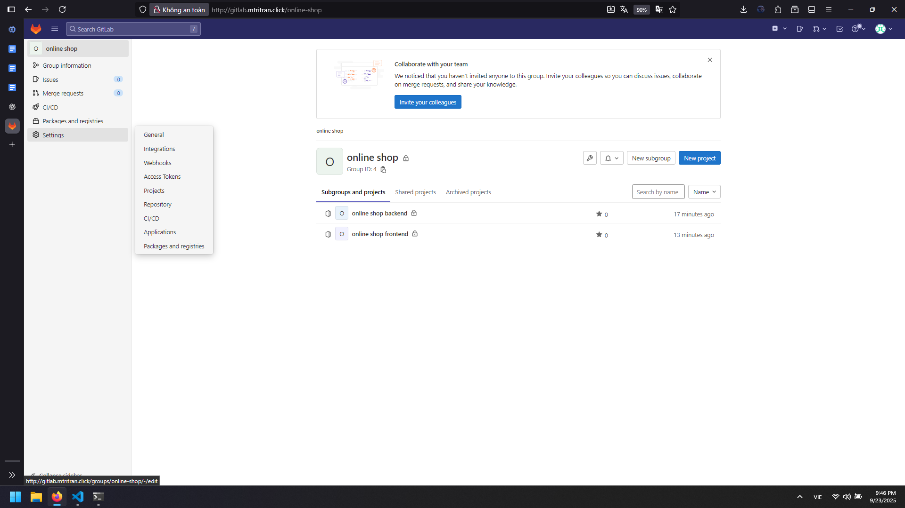

   - Add variable: `SNYK_TOKEN`
   - Value: Your Snyk authentication token

  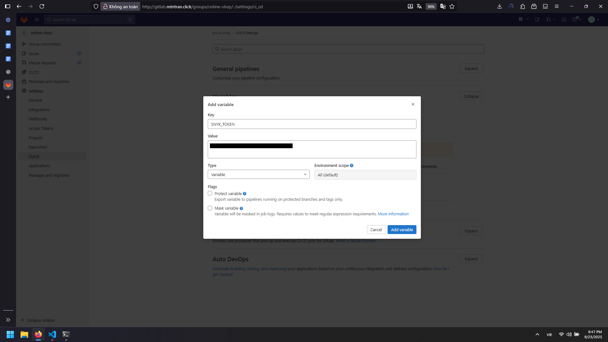
   
   - Scope: All environments
   - Protected: No

## 4. GitLab CI/CD Pipeline Configuration

### Create Pipeline Branch

1. Create new branch `pipeline-be1` from `develop`


2. Add file `.gitlab-ci.yml` with the following content:

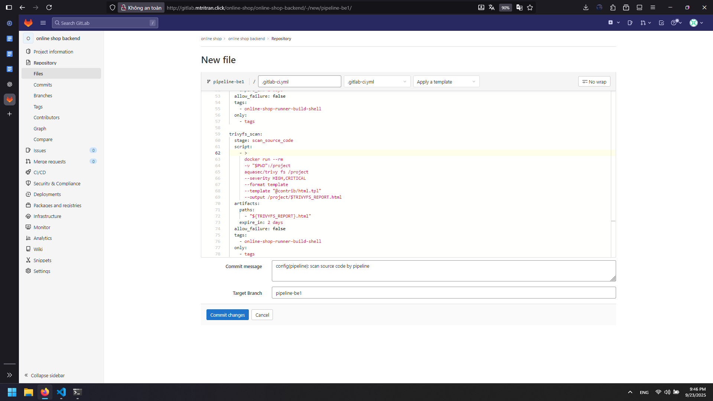

```yaml
variables:
  CODECLIMATE_REPORT: "${CI_PROJECT_NAME}_${CI_COMMIT_BRANCH}_${CI_COMMIT_TAG}_${CI_COMMIT_SHORT_SHA}_codeclimate"
  SNYKSCAN_REPORT: "${CI_PROJECT_NAME}_${CI_COMMIT_BRANCH}_${CI_COMMIT_TAG}_${CI_COMMIT_SHORT_SHA}_snykscan"  
  TRIVYFS_REPORT: "${CI_PROJECT_NAME}_${CI_COMMIT_BRANCH}_${CI_COMMIT_TAG}_${CI_COMMIT_SHORT_SHA}_trivyfs_scan"

stages:
  - scan_source_code

codeclimate:
  stage: scan_source_code
  script:
    - >
      docker run --rm
      -e CODECLIMATE_CODE="$PWD"
      -v "$PWD":/code
      -v /var/run/docker.sock:/var/run/docker.sock
      -v /tmp/cc:/tmp/cc
      codeclimate/codeclimate analyze -f html >
      "${CODECLIMATE_REPORT}.html"
  artifacts:
    paths:
      - "${CODECLIMATE_REPORT}.html"
    expire_in: 2 days
  allow_failure: false
  tags:
    - online-shop-runner-build-shell
  only:
    - tags

snykscan:
  stage: scan_source_code
  script:
    - echo "Running Snyk scan..."
    - docker pull node:18-alpine
    - |
      docker run --rm \
        -v "$PWD":/app \
        -w /app \
        -e SNYK_TOKEN="$SNYK_TOKEN" \
        node:18-alpine \
        sh -c '
          apk add --no-cache git &&
          npm install -g snyk snyk-to-html &&
          snyk auth $SNYK_TOKEN &&
          if [ -f package.json ]; then npm install; fi &&
          snyk test --json > /tmp/snyk.json || true &&
          snyk-to-html -i /tmp/snyk.json -o '${SNYKSCAN_REPORT}'.html
        '
    - ls -la ${SNYKSCAN_REPORT}.html
  artifacts:
    paths:
      - "${SNYKSCAN_REPORT}.html"
    expire_in: 2 days
  allow_failure: false
  tags:
    - online-shop-runner-build-shell
  only:
    - tags

trivyfs_scan:
  stage: scan_source_code
  script:
    - >
      docker run --rm
      -v "$PWD":/project
      aquasec/trivy fs /project
      --severity HIGH,CRITICAL
      --format template
      --template "@contrib/html.tpl"
      --output /project/$TRIVYFS_REPORT.html
  artifacts:
    paths:
      - "${TRIVYFS_REPORT}.html"
    expire_in: 2 days
  allow_failure: false
  tags:
    - online-shop-runner-build-shell
  only:
    - tags
```
File pipeline here: [pipeline/scan-source-code.yml](pipeline/scan-source-code.yml)

## 5. Pipeline Execution

### Trigger Pipeline

1. **Create Git Tag:**
   - Repository → Tags → New tag

  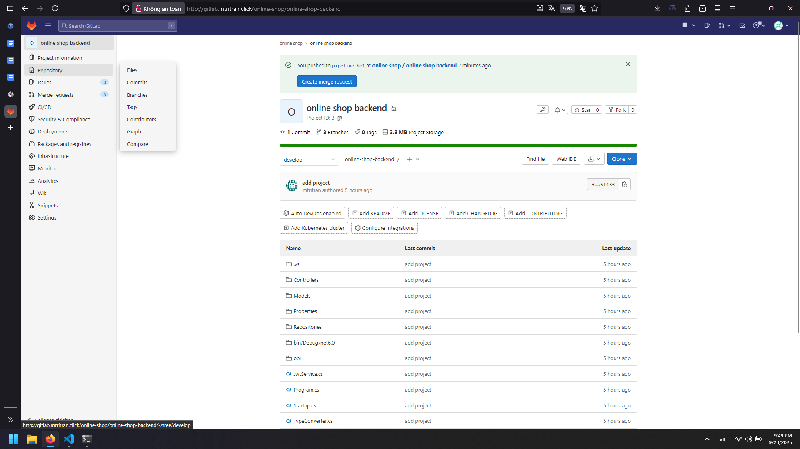

   - Tag name: `v1`
   - Create from: `pipeline-be1` branch

  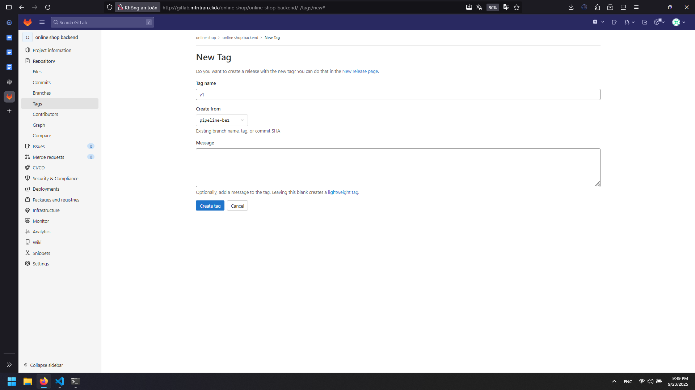

2. **Monitor Pipeline:**
   - CI/CD → Pipelines

  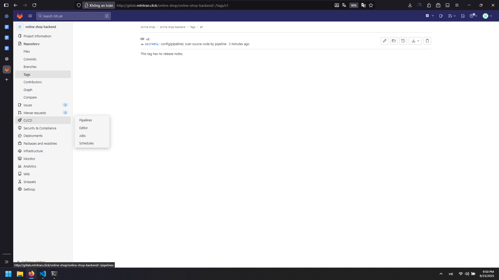

   - Watch pipeline execution status
   - All three jobs should appear in "Running" state

  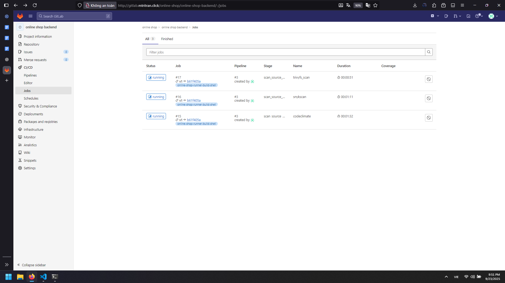

### Download Reports

1. **Access Job Artifacts:**
   - After three jobs passed
   - CI/CD → Jobs → Select completed job
   - Click "Browse" button
   - Download "artifacts archive"

  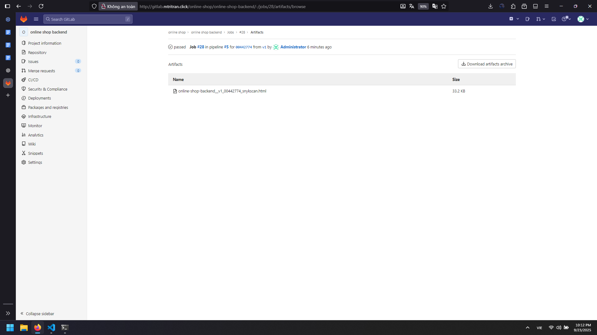

2. **View Reports:**
   - Extract downloaded archive
   - Open HTML reports in web browser
   - Review security findings and recommendations

   - Snyk report: [artifacts/online-shop-backend__v1_00442774_snykscan.html](artifacts/online-shop-backend__v1_00442774_snykscan.html)
  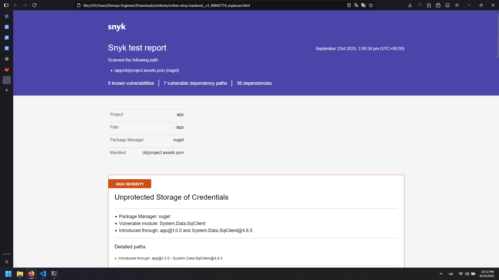
  
   - Codeclimate report: [artifacts/online-shop-backend__v1_00442774_codeclimate.html](artifacts/online-shop-backend__v1_00442774_codeclimate.html)
  

   - Trivyfs report: [artifacts/online-shop-backend__v1_00442774_trivyfs_scan.html](artifacts/online-shop-backend__v1_00442774_trivyfs_scan.html) 
  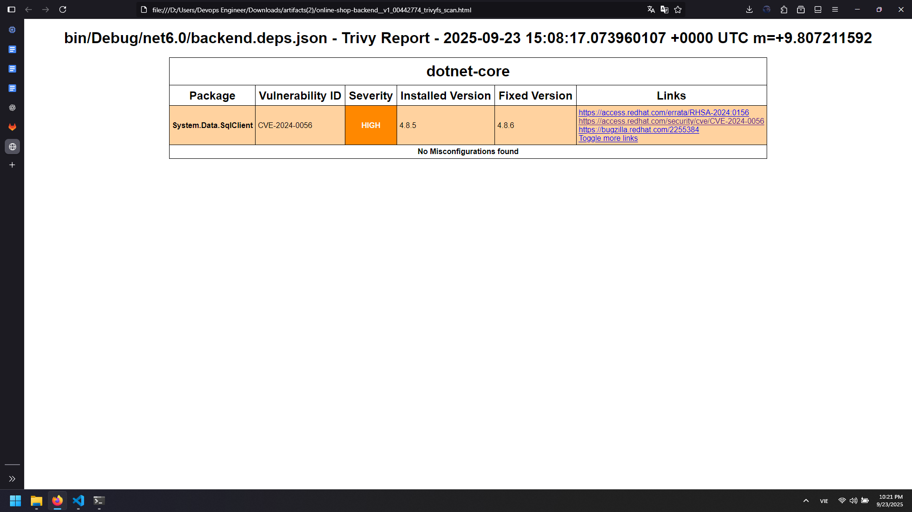

## 6. Security Scanning Tools Overview

### CodeClimate
- **Purpose:** Code quality and maintainability analysis
- **Detects:** Code smells, complexity issues, duplication
- **Output:** Maintainability scores and technical debt

### Snyk
- **Purpose:** Vulnerability detection in dependencies
- **Detects:** Known CVEs in packages, license issues
- **Output:** Vulnerability severity ratings and fix recommendations

### Trivy
- **Purpose:** Comprehensive security scanner
- **Detects:** OS packages, language-specific packages, IaC misconfigurations
- **Output:** High and critical severity vulnerabilities

## 7. Pipeline Configuration Explained

### Variables Section
- Dynamic report naming using GitLab CI variables
- Includes project name, branch, tag, and commit SHA
- Ensures unique artifact names for each pipeline run

### Job Configuration
- **Stage:** All jobs run in parallel during `scan_source_code` stage
- **Tags:** Specifies which runner to use (`online-shop-runner-build-shell`)
- **Only:** Triggers only on git tags (not on every commit)
- **Artifacts:** Preserves HTML reports for download
- **Allow failure:** Set to `false` to fail pipeline on security issues

### Docker Integration
- Each tool runs in isolated Docker containers
- Mounts project directory for scanning
- Uses official tool images for consistency

## 8. Best Practices

### Security Integration
- Run scans on every release (tag-based triggers)
- Set appropriate failure thresholds
- Review reports before deployment
- Track security debt over time

### Report Management
- Archive reports for compliance
- Set appropriate artifact expiration
- Implement automated report analysis
- Integrate with security dashboards

### Pipeline Optimization
- Cache Docker images when possible
- Run scans in parallel for faster feedback
- Use appropriate runner resources
- Monitor scan execution times

This implementation provides a robust security scanning foundation that can be extended with additional tools and integrated into comprehensive DevSecOps workflows.